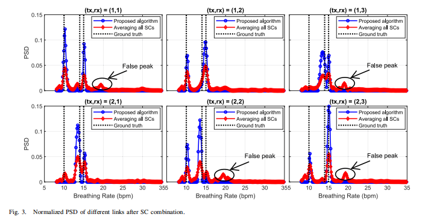

# 有关于文献整理

# Is Driver on Phone Call? Mobile Device Localization using Cellular Signal

《驾驶者是否在通话？使用蜂窝信号进行移动设备定位》，提出了一种名为 **PhoLoc** 的路侧检测系统，核心推动技术是一种==新的近场定位方案==，该方案能够通过==窃听移动手机的蜂窝信号==来估计其在特定时刻的位置。旨在识别驾驶员在行车过程中违规使用手机通话的行为。

## **1. 文献综述与背景**

文章首先回顾了现有检测驾驶员分心驾驶行为的技术手段及其局限性：

- **基于摄像头的系统：** 这是目前最自然的方法，通过路侧高分辨率摄像头捕捉违规行为。然而，该方案在==黑暗、恶劣天气==或驾驶员==刻意遮挡==时效果有限，且极易引发==公众对隐私的担忧==。
- **智能手机传感器：** 利用手机内置的全球定位系统（GPS）和惯性测量单元（IMU）来检测行为。虽然技术日益成熟，但这些传感器只能在车内使用，无法作为路侧基础设施进行执法。
- **车内射频（RFID）系统：** 同样受限于只能在车内部署，无法实现路侧监管。
- **手机定位设计挑战：**
  * 基于无先验的宽范围变化车辆速度挑战联合估计车辆速度和手机位置
  * VoIP 数据流量的低数据包率(语音通话期间的 VoIP 数据包率可能低至每秒 25 个数据包)蜂窝信号的稀疏性
  * NLoS 路径可能不可忽略

> [!NOTE]
>
> #### 附：VOIP还有VOLTE
>
> #### 附：LOS与NLOS
>
> ##### 1. 视距路径 (LoS - Line of Sight)
>
> **定义：** 信号沿直线直接从发射机到达接收机，中间没有任何物理障碍物遮挡。
>
> - **物理表现：** 信号最强，路径最短，延迟最低。
> - **在本论文场景中：** 手机就在车窗边，或者正对着挡风玻璃。电磁波像光束一样直接射入 PhoLoc 的天线。
> - **意义：** 这是定位的“黄金数据”。在这种情况下，PhoLoc 测量到的相位差最准确，能够实现厘米级的定位。
>
> ------
>
> ##### 2. 非视距路径 (NLoS - Non-Line of Sight)
>
> **定义：** 发射机和接收机之间的直连路径被障碍物完全挡住。信号必须通过**反射、折射或衍射**才能到达接收机。
>
> - **物理表现：** 信号变弱，路程变长（导致延迟增加），相位会发生扭曲。
> - **在本论文场景中（主要挑战）：**
>   - **身体遮挡：** 驾驶员侧身接电话，头和肩膀挡住了手机向窗外发射的直线。
>   - **车体遮挡：** 手机放在中控台下方或大腿上，信号被金属车门或 A 柱挡住，只能通过车内反射或绕射（衍射）出来。
>   - 车内外反射以及衍射
> - **后果：** 接收到的信号会产生“伪距”。因为信号绕路了，设备会误以为手机离得更远，或者角度发生了偏转，从而导致定位误差。

- **无线定位技术：** 现有的AoA（到达角）或ToF（飞行时间）定位技术通常<mark>依赖于信道状态信息（CSI）</mark>。但在路侧监听场景下，作为“窃听者”的检测设备极难估计移动设备的CSI，因为这本身具有==计算难度==，需要==精细的时间/频率同步==以及已知的解调参考信号，基站的==动态资源分配和用户调度==给 PhoLoc 的信道估计增加了另一个挑战。

> [21]S. Coleri, M. Ergen, A. Puri, and A. Bahai, “Channel estimation techniques based on pilot arrangement in ofdm systems,”IEEE
> Transactions on broadcasting, vol. 48, no. 3, pp. 223–229, 2002.
>
> 讲述了CSI估计的问题，手机上行链路参考信号的知识 
>
> 

> [!NOTE]
>
> ###  CSI 获取方式的区别：协作 vs 非协作
>
> - **传统/标准定位（如基站定位）：** 基站和手机是“自己人”，手机会主动配合发送高质量的导频，基站能获得**完美的 CSI（信道状态信息）**。
> - **PhoLoc（路侧监听）：** 作为一个“窃听者（Sniffer）”，它是**非协作式**的。
>   - **区别：** 它必须通过“盲估计”来截获信号。这种方式获取的 CSI 质量很差、噪声极大。论文的区别在于它不追求“完美 CSI”，而是通过算法在**噪声极大的 CSI** 中提取出稳定的相位轨迹。

### 核心思想

* 增加天线间距，使天线阵列具有大孔径。大天线
  孔径将远场定位问题转化为<mark>近场定位问题</mark>，从而可以利用车辆（手机）的移动在给定时刻生成集中的位置模式。具体
  而言，PhoLoc 将定位问题表述为一个优化问题，并通过最大化测量信道与其在车辆轨迹上的投影 LoS 分量之间的互
  相关性，来搜索手机在给定时刻的最佳位置值（例如图 1 中的 (x0, y0)）。

* 所提出的近场定位方案的一个关键问题是信道估计，低复杂度的手机定位信号处理流水线，不需要时间/频率同步，还有信道估计。

* 联合处理来自两个传感器（无线电和激光雷达）的多模态数据来执行系统集成和优化。它利用车辆被检测到的持续时间和私家车的平均长度来估计车辆速度，减少优化问题求解时间。

* 分析从车辆窃听到的蓝牙信号，以确定驾驶员是在进行手持通话还是免提通话

> [!NOTE]
>
> ### 附：近场定位和远场定位以及阵列信号
>
> #### **远场定位 (Far-field)：平面波模型**
>
> - **场景：** 手机距离基站（或天线阵列）很远。
> - **原理：** 虽然电磁波本质上是从一个点向外扩散的圆圈（球形波），但由于距离太远，当它到达你的天线阵列时，波前（Wavefront）已经变得非常平整，可以近似看作是一条**直线（平面波）**。
> - **定位特征：** 在天线阵列上的每个天线收到的**相位偏移是线性的**。
> - **计算维度：** 通常只能测出**角度 (AoA)**，很难直接测出距离。
>
> #### **近场定位 (Near-field)：球形波模型**
>
> - **场景：** 手机距离接收天线非常近（比如 PhoLoc 这种路侧设备盯着近处的车辆）。
>
> - **原理：** 此时波的曲率不能被忽略，它表现为明显的**球形波**。
>
> - **定位特征：** 到达不同天线的相位差**不是线性的**，而是呈现出一种**弧度（曲率）**。
>
> - **定位维度：** 这是一个巨大的优势——仅通过一个天线阵列，就能同时测出**角度 (AoA) 和 距离 (Range)**。
>
> - | **特性**          | **远场 (Far-field)**                       | **近场 (Near-field)**                 |
>   | ----------------- | ------------------------------------------ | ------------------------------------- |
>   | **距离判据**      | 距离 $d > \frac{2D^2}{\lambda}$ (瑞利距离) | 距离 $d < \frac{2D^2}{\lambda}$       |
>   | **波前形状**      | **平面 (Planar)**                          | **球形 (Spherical)**                  |
>   | **建模难度**      | 简单（线性方程）                           | 复杂（非线性泰勒展开）                |
>   | **测量能力**      | 只能测角度 $\theta$                        | **能同时测角度 $\theta$ 和 距离 $r$** |
>   | **PhoLoc 的角色** | 类似看远处的星星                           | 类似近距离观察飞过的苍蝇              |
>
> ### 1. 转化条件：瑞利距离 (Rayleigh Distance)
>
> 在电磁学中，区分近场和远场的公认标准是**瑞利距离（Rayleigh Distance）**，公式如下：
>
> $$L =  \frac{2D^2}{\lambda}$$
>
> - **$D$：** 天线阵列的**最大孔径**（即阵列一头到另一头的总长度）。
> - **$\lambda$：** 信号的**波长**（4G/5G 频率越高，波长越短）。
>
> #### **转化逻辑：**
>
> - **近场 (Near-field)：** 当手机到天线的距离 **$r < L$** 时，波前是**弯曲的（球形波）**。
> - **远场 (Far-field)：** 当距离 **$r > L$** 时，波前的曲率已经小到可以忽略不计，我们可以把它**转化（近似）为平面波**。
>
> 论文中就是通过<mark>大天线孔径</mark>将远场定位问题转化为<mark>近场定位问题</mark>
>
> ### 阵列信号 (Array Signal)
>
> **阵列信号**并不是一种特殊的电波，而是指**一组排列在一起的天线同时接收到的信号集合**。
>
> #### **直观理解：**
>
> - **单天线：** 像一只耳朵，你只能听到声音有多大，很难判断精确方位。
> - **阵列信号：** 像一排耳朵（比如有 8 个天线）。
>   - 当信号从侧面射来时，第 1 个耳朵先听到，第 8 个耳朵最后听到。
>   - 这 8 个天线收到的信号之间存在微小的**时间差**和**相位差**。
>
> #### **阵列信号处理的三个要素：**
>
> 1. **阵元（Elements）：** 阵列中的每一个独立天线。
> 2. **拓扑结构（Geometry）：** 天线是怎么摆的？（横着排叫线阵，围成圈叫圆阵）。
> 3. **导向矢量（Steering Vector）：** 这是一个数学向量，描述了从某个特定角度射入的信号，在各个天线上产生的相位变化规律。**它是定位的“密码本”。**
>
> ------
>
> ### 3. 近场 vs 远场在“阵列信号”上的表现
>
> - **在远场阵列中：** 信号在所有天线上的幅度是**一样**的，只有相位呈**线性**变化（等差数列）。
> - **在近场阵列中：** 信号在靠近手机的天线上声音**更大**，且相位的变化是**非线性**的（因为每个天线到手机的距离差不成比例）。

## 2. 工作原理

PhoLoc 系统的工作原理可以分为 **硬件架构**、**核心定位算法** 和 **多模态数据融合** 三个主要部分。

简单来说，PhoLoc 是一个“路侧窃听”装置，它不依赖手机或基站的配合，通过“听”手机发出的信号声音（射频信号）和“看”车辆的位置（激光雷达），来判断手机是否位于驾驶座上。

以下是详细的工作原理通过解读：

## 1. 系统硬件架构 (Hardware Architecture)

PhoLoc 系统由两个核心传感器组成，安装在路边：

- **多天线无线电接收机 (Multi-antenna Radio Receiver)：** 配备 4 根天线，用于“窃听”过往车辆中手机发出的蜂窝网络（LTE/5G）上行信号 。
- *关键设计：* 天线之间的间距被故意拉大（例如 5 英尺/约 1.5 米），这与其说是为了通信，不如说是为了形成一个大的“孔径”。这使得系统可以将传统的“远场”定位问题转化为“近场”定位问题，从而利用车辆移动产生的独特信号模式进行精确定位 。

> [!NOTE]
>
> #### 附：蜂窝网络信号
>
> 蜂窝网络（LTE/5G）本质上是双向通信。为了让基站知道你在哪里、你在做什么，手机必须不断向基站发送数据，这被称为**上行链路（Uplink）**。
>
> ##### 手机什么时候发出信号？
>
> 手机并不是只有在拨通电话那一刻才发信号，它的发射行为分为以下几种情况：
>
> - **通话状态（论文关注的重点）：** 当你进行语音通话时，手机需要实时、连续地将你的声音数据编码并上传。这种信号**强度大、持续时间长且极具规律性**，最容易被 PhoLoc 捕获。
>
>   链路的结构
>
>   - **上行链路（手机 $\rightarrow$ 基站）：** 传输驾驶员的声音数据。
>   - **下行链路（基站 $\rightarrow$ 手机）：** 传输对方的声音数据。
>
>   FDD 与 TDD：两条路是怎么分的？
>
>   上下行信号在空中会撞车吗？这取决于网络模式：
>
>   - **FDD（频分双工）：** 就像两条平行的车道。上行用频率 A，下行用频率 B。PhoLoc 只需要把接收频率调到 A 频道，就能只听手机说话，不听基站说话。
>   - **TDD（时分双工，如 5G 常用）：** 就像单行道定时轮岗。前 1 毫秒大家一起发上行，后 1 毫秒大家一起收下行。PhoLoc 必须具备极高的时间同步能力，精准地在“上行时间窗口”内进行捕捉。
>
>   即使你不说话，只要对方在说话，手机也会频繁发出信号
>
>   - **确认机制 (ACK/NACK)：** 在数字通信中，每当你收到对方的一段语音（下行），你的手机必须立刻回一个简短的信号给基站：“收到了，请发下一段。”
>   - **功率控制信号：** 手机要不断告诉基站：“信号太强了，调小点”或者“太弱了，听不清”。
>
>   **结论：** 只要电话接通了，即便驾驶员一言不发，只是在听对方说话，他的手机也会因为要响应“下行链路”而产生密集的“上行链路”信号。**这对 PhoLoc 来说是绝佳的检测机会。**
>
> - **数据传输：** 当你刷抖音、发微信、上传照片时，手机会高频率地发出信号包。
>
> - **信令交互（握手）：** 即使把手机放在兜里不动，它也会定期发出微弱的“心跳信号”（Registration/Location Update），向基站报备：“我还在这片区域，有电话请转接给我。”
>
> - **小区切换：** 当你在高速行驶的汽车上时，手机会频繁地与沿途不同的基站“握手”切换，这时会发出较强的控制信号。
>
> ##### **物理形式：电磁波**
>
> 手机发出的信号位于特定的**超高频（UHF）频段**。
>
> - **4G LTE：** 常见频段如 700MHz, 1800MHz, 2100MHz 等。
> - **5G：** 频率更高，甚至包含毫米波。 这些电磁波以光速传播，可以穿透车窗玻璃。
>
> ##### 信号是怎么穿透车身的？
>
> 手机发出的高频电磁波（如 $1.8\text{ GHz}$ 或 $2.1\text{ GHz}$）面对不同材质的表现完全不同：
>
> - **金属车身（阻挡）：** 汽车的金属外壳（钢板或铝板）对电磁波来说几乎是“一堵墙”。金属具有良好的导电性，会产生**法拉第笼（Faraday Cage）效应**，将大部分电磁波反射回去或吸收掉。
> - **玻璃窗（透射）：** 玻璃是电磁波的主要“出口”。标准玻璃对蜂窝信号的阻碍很小，电磁波就像光一样从窗户向外衍射。
> - **非金属缝隙（衍射）：** 电磁波具有波粒二象性，它们会通过车窗、天窗、甚至车门缝隙发生**衍射（Diffraction）**。
>
> ##### **技术特征：OFDMA 调制**
>
> 这是现代蜂窝网络的核心技术。信号不是杂乱无章的，而是被切分成极小的**资源块（Resource Blocks）**。
>
> - **相位特征：** 信号波形有精确的相位。PhoLoc 系统正是通过测量信号到达不同天线的**相位差**（Phase Difference）来计算角度的。
> - **特征码：** 信号中包含特定的“参考信号”（Reference Signals），这就像是信号的身份证，虽然 PhoLoc 不解密你的通话内容，但它可以识别出“这是一个 LTE 信号”。
>
> 

- **低成本激光雷达 (LiDAR)：** 用于检测车辆的存在 。
  - 它记录车辆车头经过的精确时间 ($t_s$)。
  - 它测量车辆侧面与路侧设备的距离 ($y_s$) 。

## 2. 工作流程 (Workflow)

系统通过以下四个步骤来判定违规行为 ：

#### 第一步：检测是否有电话正在进行 (Phone Signal Search)

- 当车辆接近时，PhoLoc 会扫描所有可能的蜂窝上行频段。如果检测到持续且强度超过阈值的信号，就认为车内有正在进行的通话 。
- 因为车辆离设备很近（几十米内），手机信号会非常强且随距离变化明显，易于识别 。

#### 第二步：排除免提通话 (Hands-Free Detection)

- 系统会同时监测蓝牙信号。如果发现高强度的蓝牙数据传输（车载蓝牙通话的特征），系统会判定这是合法的“免提通话”，从而不视为违规 。

  第三步：核心定位——手机在哪里？ (Near-Field Localization)

这是论文最核心的创新点。由于 PhoLoc 是第三方设备，无法与手机同步，也无法解调加密的通信内容，因此它采用了一种**无需信道状态信息 (CSI-free)** 的定位方案 ：

1. 

   **信号相位提取：** 虽然无法解调内容，但系统可以提取接收到的基带信号在不同天线间的**相位差** 。

2. 

   **构建虚拟转向矢量：** 系统根据物理几何关系（天线位置、假设的手机位置和速度），构建一个理论上的信号相位变化模型 。

3. 

   **暴力搜索优化：** 系统在可能的空间范围内搜索最佳的手机起始坐标 $(x_0, y_0)$ 和速度 $v$，使得实际接收到的信号相位与理论模型最匹配（互相关值最大） 。

   

   *抗干扰：* 这种方法利用了天线的大间距和车辆的高速移动，能有效对抗多径效应（反射信号）的干扰 。

   

   

#### 第四步：多模态融合判定 (Data Fusion & Decision)

系统将无线电计算出的“绝对位置”与激光雷达测得的“车辆位置”结合，计算手机在**车内**的相对位置 $(\Delta x, \Delta y)$ ：

- **横向位置 ($\Delta x$)：** 判断手机是在前排还是后排。通过对比无线电定位的手机位置与激光雷达检测到的车头时间差来计算。
- **纵向深度 ($\Delta y$)：** 判断手机是在左侧（驾驶座）还是右侧（副驾）。通过对比无线电测得的深度 ($y_0$) 和激光雷达测得的车身距离 ($y_s$) 来计算。

### 3. 判定逻辑

如果计算出的相对位置 $(\Delta x, \Delta y)$ 落在了驾驶座的区域范围内（例如：$\Delta x$ 较大且 $\Delta y$ 较小，具体阈值根据车型长度动态调整），且没有检测到蓝牙免提信号，系统就会判定为**驾驶员违规通话** 。

### 总结

PhoLoc 的巧妙之处在于它不需要破解手机内容，也不需要复杂的同步，而是利用**大间距天线阵列**捕捉车辆飞驰而过时信号相位的细微变化（多普勒效应和几何相位变化的结合），像“听声辩位”一样精准锁定手机在车内的几厘米范围内的位置。

有关名词补充：

多模态数据：

### 1. 模态（Modality）的定义

每一种信息的来源或形式都可以称为一种“模态”。常见的模态包括：

- **文本：** 书籍、论文、网页内容。
- **图像/视频：** 照片、监控录像。
- **音频：** 语音、环境音。
- **物理信号：** 传感器数据、GPS 坐标、**射频信号（RF）**、**激光雷达点云（LiDAR）**。

### 2. 本论文中的多模态数据组合

PhoLoc 系统之所以强大，是因为它并没有只盯着一种数据，而是把两种完全不同的物理信号融合在了一起：

| **模态类型**      | **硬件来源**           | **它的作用（感知了什么）**                                   |
| ----------------- | ---------------------- | ------------------------------------------------------------ |
| **射频模态 (RF)** | 4 天线无线电接收机     | 感知**手机**的位置。它通过监听手机发出的电磁波相位，判断“信号源”在哪。 |
| **几何/空间模态** | 低成本激光雷达 (LiDAR) | 感知**车体**的位置。它通过发射激光测距，判断“车壳”在物理空间中的坐标。 |

### 3. 为什么要用“多模态”？（1+1 > 2）

如果只用单一模态，这个系统就很难跑通：

- **只用射频：** 系统只知道手机在路上的某个坐标，但它不知道这个坐标是在车内还是在车外，是在驾驶座还是在副驾驶。
- **只用激光雷达：** 系统只能看到一辆车开过去，但它完全看不见车里的人有没有在打电话。

**多模态融合的逻辑：**

系统通过激光雷达确定了车体的“绝对坐标系”，然后再把射频信号定位出的手机坐标“套”进这个坐标系里。通过对比两者的相对位置，系统才能最终判定：**“这个手机信号源正处于这辆车的驾驶座空间内。”**

## AI辅助prompt

请在保持格式不变，尽可能还原的条件下全文翻译我给你的这篇文章，并且请注意不要有漏翻少翻的情况，并且要将专业名词翻译准确，并且旁边附上括号（内部是名词英文）请你再检查一下有没有少翻漏翻并仔细修改，如果有图片等等其他的请空出位置（我后续可以方便编辑插入），不要出现翻译不到位不忠于原文的情况，然后返还给我完整版的tex

注意不要报错

# WiResP: A Robust WiFi-Based Respiration Monitoring via Spectrum Enhancement

 《WiResP：基于频谱增强的鲁棒 WiFi 呼吸监测系统》，提出了一种名为 **WiResP** (WiFi Respiration Perception) 的新型感知系统，该系统能够从极度微弱的背景噪声中提取出呼吸特征。

## 文献综述与背景

文章首先回顾了呼吸监测技术的发展，近年来 WiFi 感知逐渐成为一种低成本、非接触式的呼吸监测方案。

- **接触式与专用设备系统：**  
  传统呼吸监测通常依赖胸带、心电图（ECG）或鼻罩等接触式设备。这类方法虽然测量精度高，但需要与人体直接接触，容易造成不适，尤其会干扰用户的自然睡眠体验。  

- **基于 RSSI 的 WiFi 呼吸感知：**  
  早期的 WiFi 呼吸检测主要依赖接收<mark>信号强度（RSSI）</mark>的变化，通过信号强弱波动来推测胸部起伏。然而 RSSI 只能提供非常粗粒度的总能量信息，分辨率较低，难以捕捉呼吸这种极其微弱的周期性运动，精度往往有限。

- **基于 CSI 的 WiFi 感知及其瓶颈：**  
  随着研究深入，越来越多工作开始采用更精细的<mark>信道状态信息（CSI）</mark>，利用信号幅度与相位的细微变化来检测呼吸。相比 RSSI，CSI 能提供更丰富的无线传播细节。  

  但在真实家庭场景下，如果用户位于隔壁房间（穿墙/NLoS），或者身体被厚被子覆盖，呼吸带来的信号扰动会变得极其微弱，容易被环境噪声淹没，导致信噪比（SNR）过低，从而出现检测失败。

  同时，室内传播还受到<mark>菲涅尔区效应</mark>影响：在某些位置，反射波与直射波可能相互抵消，使得 CSI 对呼吸变化不敏感。若用户恰好处于这种“盲区”，系统即使面对真实呼吸也可能无法产生明显响应。

综上，WiResP解决的正是在低信噪比、非视距以及复杂多径环境下稳定增强呼吸信号的问题。

> [!NOTE]
>
> ### **核心概念**
>
> #### **1. CSI (信道状态信息) vs RSSI (接收信号强度)**
>
> **定义：**
> * **RSSI：** 在原文中指的是接收端某个时刻接收到的**总信号强度/总功率**。
>  * **CSI：** 在原文中指的是接收端听到的回声图谱。它描述了信号是通过哪几条路（多径）传过来的，每一路的声音延迟了多久（相位）、衰减了多少（幅度）。
>
> **为什么 WiResP 更偏向 CSI：**
> - 个人结合原文的理解：呼吸产生的变化是很微弱的。RSSI把所有信号合并成一个数值，呼吸造成的微小变化很可能被平均掉；而CSI保留了子载波，某些子载波更容易表现出呼吸的周期性成分，所以也更适合做呼吸信号的提取。
>
> ------
>
> #### **2. LoS (视距) vs NLoS (非视距)**
>
> **定义：**
>  * **LoS (Line of Sight)：** 发射机和接收机之间无遮挡，信号直达  。
>  * **NLoS (Non-Line of Sight)：** 直连路径被墙壁、家具或人体阻挡，信号主要靠反射、衍射到达  。
>
> **物理表现：**
> * **LoS：** 信号强，呼吸引起的胸部反射占主导地位，波形清晰。
> * **NLoS：** 信号极弱，且噪声占比很大。呼吸信号可能只有背景噪声的几十分之一。
>
> **在本文场景中：**
>  * 大多数现有系统一遇到 NLoS 就失效。WiResP 的目标就是“隔墙观息”，在信号甚至比噪声还弱的情况下（Low SNR），依然把呼吸信号提取出来  。
>
> ------
>
> #### **3. 菲涅尔区 (Fresnel Zones)**
>
> **定义：**
>  * 无线电波的传播空间不是一条线，而是一个以收发设备为焦点的橄榄球形（纺锤体）区域。这个区域被分成层层的椭圆皮，即菲涅尔区。本文在实验结果讨论中引用菲涅尔区思想来解释“某些位置检测更好、某些位置更差”的现象。
>
>
> **干涉效应：**
>  * **奇数区（增强）：** 这里的反射波走的路程，刚好能和直射波“步调一致”（同相），它们加在一起，信号变强  。
>  * **偶数区（抵消）：** 这里的反射波走的路程，刚好和直射波“步调相反”（反相），它们互相抵消，信号变弱甚至消失  。
>
> **后果（感知盲区）：**
>  * 如果用户躺在床上的位置，刚好处于某个“偶数菲涅尔区”的边缘，用户的胸部起伏可能会导致反射波和直射波**完美抵消**。这时候，无论用户呼吸多用力，接收机那里都是一片死寂。这就是为什么传统 WiFi 感知对设备摆放位置极其挑剔。
>---

##  WiResP 工作原理

### 硬件架构 (Hardware Architecture)

WiResP 的硬件追求**简便**和**普适**。

* **商用 WiFi 设备：** 系统仅由一对标准的 WiFi 收发设备（发射机 TX 和 接收机 RX）组成。
*  **灵活部署 (Flexible Deployment)：** 设备不需要像传统方案那样必须放在床头柜（LoS）。发射机甚至可以放在客厅，接收机放在卧室，或者安装在天花板上。

###  工作流程 (Workflow)
## **第一步：CSI 预处理 (CSI Pre-processing)**

WiFi 设备接收到的原始 CSI 信号通常包含大量环境噪声和硬件误差，因此不能直接用于呼吸检测。

首先，WiResP 会对 CSI 数据进行**归一化处理**，使不同子载波的数值处于同样的范围内；随后去除突发的异常点，从而得到更干净的信号输入。  

### **只保留幅度，舍弃相位**

- WiResP系统放弃了**CSI 的相位信息**，仅使用更稳定的 **幅度 (Amplitude)**

原因是：在普通 WiFi 设备上，相位会受到噪声影响，极不稳定，因此难以可靠反映呼吸这种微弱变化。

---

## **第二步：运动检测机制 (Motion Detector)**

在检测呼吸之前，系统必须先确认环境处于“静止”状态。

因为呼吸引起的胸部起伏非常微小，如果出现翻身、走动等大幅动作，信号波动会远远超过呼吸信号，从而导致估计失败。

WiResP 会计算 CSI 幅度的**自相关函数 (ACF)**，并观察统计值 ξ：
- 首先，预设一个阈值η，该阈值η是通过评估典型日常人体运动（不包括静态活动）凭经验选择的
- 如果 ξ 的波动超过预设阈值 η  
- 说明环境中存在明显运动  
- 系统会暂停呼吸估计，直到环境恢复平静再继续

这一机制有效避免了运动干扰带来的错误读数。

---

## **第三步：呼吸信号增强**

### 子载波选择和合并
这是 WiResP 进行信号增强的第一阶段。

> 原文中提到：“由于多径对单个子载波的影响波动不定，子载波的选择和合并可能具有挑战性。仅仅计算所有子载波的平均值可能无法有效提高合并后信号的SNR，特别是当测试者远离链路时。在这种情况下，某些子载波可能比其他子载波受到更严重的破坏”

这一大段话的意思通俗来说就是：
- WiFi 信号包含大量子载波，但并不是每一个都对呼吸敏感
- 有些子载波处于“敏感区”，能清楚反映呼吸节律  
- 有些则可能因为上文提到的菲涅尔效应处于“盲区”，几乎检测不到呼吸
- 传统方法通常直接平均所有子载波，但这样会稀释有效信号

基于此，WiResP 引入了：

 <mark>BNR (Breathing-to-Noise Ratio)</mark>

该指标用于衡量某个子载波在正常呼吸频率范围（10–30 BPM）内的能量占比。

系统会选择 BNR 得分最高的 K 个子载波，并对它们进行加权合成，从而提升呼吸信号的信噪比。

### **ACF谱增强**
这是 WiResP 进行信号增强的第二阶段。

- WiResP 会将连续时间窗口内的 ACF 信号按顺序拼接，形成一张二维的 <mark>ACF Spectrum（ACF 频谱图）</mark>

- 在这张图上，稳定呼吸会表现为连续的波纹状条纹，具有波峰和波谷。

> 对应原文的片段：“通过连接连续时间窗口的ACF来获得ACF谱。当在此时间跨度内存在有效呼吸时，连接起来的ACF形成可辨别的呼吸轨迹，具有互连的波峰和波谷，代表呼吸信号的周期性。”

- 为了改善峰值识别和呼吸模式识别，引入<mark>直方图均衡化</mark>的方法

- 该方法能够拉大对比度，使隐藏在噪声背景中的呼吸条纹更加清晰，从而显著扩展系统的感知覆盖范围。

---

## **第五步：呼吸轨迹连续性检查 (Trace Continuity Check)**

即使经过增强，系统仍可能受到周期性噪声干扰（例如窗帘摆动），产生类似呼吸的假信号。
因此 WiResP 最后加入了一道“呼吸真实性检查”。

### **Otsu 二值化**
系统使用 <mark>Otsu 算法</mark>自动寻找最佳阈值，将增强后的频谱图转化为黑白二值图像，简化后续分析。

系统会检查二值化后的图像中：

- 白色条纹（呼吸波峰）是否在时间上连续  
- 波形宽度与周期是否符合正常呼吸规律  

只有满足这些生理特征的连续轨迹，才会被判定为有效呼吸，并通过波峰间隔计算最终呼吸率 (RPM)。

---

## **工作流程总结**

WiResP 的核心流程可以概括为：

1. 清洗 CSI 幅度信号  
2. 检测并排除运动干扰  
3. 选择最敏感子载波提升信噪比  
4. 将频谱当作图像进行对比度增强  
5. 通过连续性校验减少误报并输出呼吸率  

从而实现远距离甚至穿墙条件下的鲁棒呼吸监测。

> [!NOTE]
>
> ### **核心技术概念**
>
> #### **1. BNR (Breathing-to-Noise Ratio)**
>
>  **原文观点：** BNR是感兴趣范围（即正常人体呼吸）内能量与范围外能量的比例。
>
> **深度解读：**
> * **背景：** 在无线电信号的频域里，充满了各种噪声。呼吸是混杂在噪声中的微弱信号。
> * **定义：** BNR 就是一个呼吸信号的指标。它计算在 10-30 次/分钟（正常呼吸频率）这个特定频段内的能量，占总能量的比例。
> * **作用：** 如果某个子载波的 BNR 很高，说明它主要听到的就是呼吸，我们就要重用它；如果 BNR 很低，说明它听到的大部分是噪音，我们就要果断抛弃它。这比传统的“信噪比 (SNR)”更针对呼吸检测场景。
>
> ---
>
> #### **2. ACF 频谱图与图像化 (ACF Spectrum as Image)**
>
> **定义：** ACF全称为自相关函数 (Autocorrelation Function) 。它是系统用于量化信道环境波动、提取微弱信号的核心数学工具。
> - 从物理层面看，ACF 衡量的是信号在**不同时间点上的相似程度**。系统提取 Wi-Fi 的信道状态信息 (CSI) 后，计算当前时刻信号 $H(t,f)$ 与延迟一段微小时间 $\tau$ 后的信号 $H(t+\tau,f)$ 之间的相关性
>
>  **原文观点：** 将连续时间窗口内的 ACF 拼接起来形成频谱图，视作图像处理  。
>
> 
> * **思维转换：** 传统通信中，看信号是一条波动的曲线。WiResP 的作者把它看作是一段一段的周期信号。
>
> * **操作：** 每一秒的信号自相关分析结果，就是一小段周期。把几分钟内成百上千个周期横向排列在一起，就变成了频谱图。
> * **意义：**  单看某一刻的信号，可能因为噪声而断断续续；但看整个频谱图，会发现噪声是随机的，而呼吸节奏是连续贯穿的。这就给了我们利用“视觉规律”来修补信号的机会。
>
>
> ---
>
> #### **3. 直方图均衡化 (Histogram Equalization)**
>
>  **原文观点：** 分布强度值以增加对比度，使呼吸模式更易识别  。
>
> **深度解读：**
> * **应用场景：** 在一张对比度较低（整体偏灰、偏暗或偏亮）的图像中，它可以拉伸亮度范围，让原本难以区分的细节变得清晰可见。简单来说，就是让“暗的地方更暗，亮的地方更亮”，从而突出纹理。
>
> * **算法原理：** 这个算法会扫描整张照片，发现呼吸信号和噪声都挤在“灰色”这个狭窄的区域里。于是它强制命令：最浅的灰色变成**纯白**，最深的灰色变成**纯黑**，中间的灰色层级强行拉开距离。
> * **效果：** 经过这一拉伸，原本淹没在噪声里的呼吸信号就变得非常明显了
>
> ---
>
> #### **4. Otsu 二值化 (Otsu's Thresholding)**
>
>  **原文观点：** 频谱二值化简化了增强呼吸模式中波峰和波谷的识别，使其更容易与参考信号进行比较，从而改善对增强后ACF谱的分析并降低计算复杂度
>
> **深度解读：**
> * **难题：** 经过直方图均衡化后，频谱图虽然对比度高了，但仍然是“灰度图”（包含各种深浅不一的亮度值）。计算机很难直接判断哪里算“有效的波峰”，哪里算“背景噪声”。
>
> * **Otsu 的原理：** 这是一个**自适应**的算法。它不看具体的亮度值，而是分析并分割图像的**统计直方图**。它会遍历所有可能的分割线，计算哪一条线能让分出来的两组（前景呼吸信号 vs 背景噪声）差别最大化——即让“白的更纯粹，黑的更纯粹” 。
> * **结果：** 无论用户在明亮的客厅还是昏暗的卧室，Otsu 算法都能自动找到那个完美的切割点，把代表呼吸的“白色条纹”从背景中干净利落地抠出来，变成非黑即白的二维码图案，方便计算机数数。
>---

---

# WiCPD: Wireless Child Presence Detection System for Smart Cars

 《WiCPD：智能汽车无线儿童存在检测系统》，提出了一种名为 **WiCPD** 的新型车内感知系统，该系统利用商业 Wi-Fi 设备，基于<mark>统计电磁模型 (Statistical EM Model)</mark>，能够精准检测各种运动状态下的儿童。

##  文献综述与背景

- 早期 CPD 系统多依赖婴儿座椅上的压力、重量等物理传感器，但这类方法覆盖范围局限于座椅区域，且难以区分儿童与相似重量的物体，容易产生<mark>误报(False Alarm)</mark>与漏检。

- 为了扩大检测范围，研究者引入了**基于摄像头的计算机视觉系统**。然而视觉方法依赖光照条件，并带来隐私与额外硬件成本问题；红外传感器则容易受到车内高温环境干扰，可靠性不足。
> 原文描述如下：“基于视觉的 CPD 系统 [14]–[16] 通过使用图像/视频处理，在检测准确性方面更加可靠。然而，它们通常需要专用硬件/摄像头，从而增加了汽车的成本和能耗。同时，图像/视频的质量易受光照条件影响。尽管最新的基于机器学习的技术 [17] 取得了更好的检测准确性，但它们仍然严重依赖输入图像的质量，从而阻碍了其实用部署。”
- **雷达方案：**
  * **毫米波雷达 (mmWave Radar)** 对微小运动有高敏感性。虽然它能有效检测呼吸心跳，但雷达波束通常具有方向性，受限于<mark>视场角 (FoV)</mark>，难以覆盖车内的每一个角落（如前排座椅下方），且需要额外昂贵硬件，难以直接部署在现有车辆中。

- **Wi-Fi 感知：**
  * 随着车载 Wi-Fi 的普及，利用商用 Wi-Fi 信号实现 CPD 成为一种低成本、隐私友好的替代方案。

  * 基于此，WiCPD 提出了首个利用商用 Wi-Fi CSI 的车内儿童检测系统，通过<mark>统计电磁模型</mark>与信噪比增强策略，实现了全车无盲区覆盖。

### 核心思想：统计电磁模型

 WiCPD 的核心思想在于它不再将车内环境视为一个普通的房间，而是将其建模为一个**金属空腔 (Metal Cavity)**   。

*  **多径效应：** 在车内这个封闭的金属盒子里，Wi-Fi 信号会发生无数次反射。WiCPD证明了在这种环境下，运动物体会扰乱所有的多径信号 。通过分析整体的<mark>**多径统计特征**</mark>，而不是死盯着某一条路径，系统可以消除检测盲区——无论孩子躲在哪里（甚至是座椅下方），只要他动（或者呼吸），就会扰动整个车内的电磁场分布   。

*  **分级多目标检测：** 为了解决“既要检测剧烈挣扎，又要检测安静睡眠”的矛盾，WiCPD 设计了一套分级检测框架。
    - 首先，利用高灵敏度的<mark>**运动统计量**</mark>快速锁定清醒的儿童
    - 如果未检测到大幅运动，则切换到<mark>**呼吸增强模式**</mark>，利用信号合成技术放大微弱的胸部起伏；
    - 最后，引入了<mark>**过渡态检测器**</mark>，专门捕捉那些“睡得不踏实”的儿童（即处于睡眠和微动之间的状态），填补了现有技术在这一状态下的检测空白   。

> [!NOTE]
>
> ### **核心概念**
>
> #### **1. 统计电磁模型 (Statistical EM Model)**
>
>原文对于统计电磁模型的描述如下：“该模型计算由所有多径分量组成的信道状态信息 (channel state information, CSI) 测量的自相关函数 (autocorrelation function, ACF)。然后，我们阐述了一个运动统计量指标来量化周围运动的强度，该指标可以确保每个动态散射体，无论其位置如何，都能建设性地贡献于整体运动统计量。然而，在大多数传统的基于变化的方法中，不同位置的动态散射体可能破坏性地贡献于 CSI 的变化。因此，我们的运动检测比大多数传统的基于变化的方法 [40] 更灵敏。”
>
>对于这段话的个人理解和延伸：
>- 在车内环境中，接收端收到的wifi信号（CSI）并非单一信号，而是由无数条反射路径（即多径分量）组成的。每一条路径都有自己的幅度和相位。
>
>- 大多数传统方法通过监测这个总和信号（包含无数条多径分量的信号）的变化幅度来判断是否存在运动。
>
>   * 当车内儿童微动时，可能有些多径分量的相位发生正向偏移，另一些发生负向偏移，从而相抵消。
>
>   * 结果：接收端观测到的总信号方差可能变化极小。这就是原文中提到的“破坏性贡献”。
>
> - WiCPD系统采用的统计电磁模型不再直接分析信号的矢量和，而是计算CSI的自相关函数（即ACF，由于在WiResP中有详细解释，故此处不再赘述）。
>
>   * 根据文中的推导（即原文的公式），WiCPD 提取的“运动统计量”在数学上正比于所有动态散射体的反射功率之和，而功率是幅度的平方，**恒为正值**。
>
>   * 结果：无论物体向哪个方向运动，它产生的信号变化永远是正数。这些正数在统计量中是直接累加的，不存在正负抵消的情况。这就是“建设性贡献”
>
>---
> #### **2. 误报 (False Alarm) vs 漏报 (Miss Detection)**
>
>* **原文观点：** WiCPD系统需要在保证高检测率（$\ge 96.4\%$）的同时，维持极低的误报率  
>* **应用场景：**
>  
>    * **漏报：** 漏报指的是系统未能识别车内实际存在的儿童，这种情况是不可接受的，因为它直接关系到生命安全。
>
>    * **误报：** 误报是指系统错误地识别车内没有孩子时，反而发出报警。尽管误报不会直接危及生命，但如果系统经常误报，可能会导致车主失去对系统的信任。
>
>    * WiCPD 系统的设计中，**灵敏度调节**是一个核心难点。在检测呼吸微小变化时，系统需要极高的灵敏度。然而，高灵敏度也带来了另一个问题——**外界干扰**。比如，车外的风吹草动、行人经过、甚至是周围车体的微小振动，都可能被系统误认为是儿童的呼吸信号，从而引发误报。
>
>    * 针对这一问题，WiCPD 利用了**车身金属屏蔽效应**（即法拉第笼效应）。金属车身能有效屏蔽外部信号，使得车外的无线信号难以干扰车内的统计感知。这种设计可以有效降低误报率，同时避免漏报的发生。
>
>      
>
>
>---
>
>
> #### **3.视场角 (FoV - Field of View) vs 全向覆盖**
>
> * 定义：
>   - FoV 指的是传感器（如摄像头、雷达）能够有效探测到的角度范围。它是一个有方向性的“扇形”或“锥形”区域；
>
>   - 全向覆盖指的是传感器（主要是天线）能够在水平面上的所有方向均匀地发射或接收信号。
>
> * 物理特性：
>   - FoV为了获得高精度（如高分辨率的角度和距离信息），设备往往需要将能量集中在一个特定的方向上。
>   - 全向覆盖利用电磁波的衍射和反射特性，信号向四面八方传播。在室内或车内这种封闭/半封闭空间，信号还会通过墙壁、座椅、金属车身发生反射和散射，从而填充整个空间。
>
> * **本文中的应用：** WiCPD主要采用的是全向覆盖的探测方式
>   - 利用金属空腔效应：汽车内部可以被视为一个封闭的金属空腔 (Metal Cavity) 。Wi-Fi 射频信号在金属内壁之间会进行无数次反射，形成极其复杂的多径环境 (Multipath Environment)
>
>   - 实验验证：通过在 20 多种不同车型（包括轿车、SUV 和掀背车）中的测试，证明了该系统能够覆盖包括足部空间在内的 11 个不同位置，且不受座椅朝向或儿童姿势的影响 
>---

##  系统工作流程

 WiCPD 拥有三层检测器，分别是**运动目标检测器 (Motion Target Detector)**、**静止目标检测器 (Stationary Target Detector)**、**过渡目标检测器 (Transition Target Detector)**，只有当上一级检测失效时，才会启用下一级检测。

#### 运动目标检测器 (Motion Target Detector)

当车辆停稳并上锁后，系统首先启动**运动目标检测器**。

*  **数据清洗：** 原始的 CSI 信号往往夹杂着噪声。系统首先通过<mark>Hampel 滤波器</mark>剔除那些突兀的异常值（Outliers），确保数据的纯净。

*  **全车“共振”检测：** 系统计算 CSI 的自相关函数 (ACF) 并提取**运动统计量**。车内存在儿童运动时，运动统计量就会发生变化。

*  **判定逻辑：** 只要运动统计量超过了预设的阈值，系统就会在 **8秒内** 迅速判定“车内有人”并报警。这一步主要针对清醒、挣扎或玩耍的儿童，利用车身的金属屏蔽特性，它能有效过滤掉车外路人的干扰   。

#### 静止目标检测器 (Stationary Target Detector)

如果第一步没有检测到大幅运动，系统会认为车内可能无人，或者有一个熟睡的儿童。此时，系统切换到高灵敏度的**静止目标检测器**。

*  **寻找敏感信道：** 呼吸引起的胸部起伏只有几毫米，极其微弱。在几十个 Wi-Fi 子载波中，只有一部分子载波处于“敏感位置”（即受呼吸调制最明显）。系统会优先挑选出这些“听力最好”的子载波   。

*  **信号增强 (MRC)：** 即使选出了敏感子载波，单个信号依然容易被噪声淹没。WiCPD 引入了<mark>最大比合并 (MRC)</mark> 技术，将这些子载波的信号加权叠加   。这就像把几个微弱的声音合成一股洪亮的声音，极大地提升了<mark>信噪比 (SNR)</mark>。

* **呼吸率锁定：** 系统在增强后的信号中搜索周期性特征。如果能连续监测到频率在 **6-35 BPM** (次/分，儿童正常呼吸范围) 的稳定波动，且持续约 **20秒**，系统即判定检测到熟睡儿童   。

#### 过渡目标检测器 (Transition Target Detector)

现实中，儿童可能处于“非动非静”的中间状态（如睡觉时偶尔翻身、抽动）。若上述两级检测器均失效，则需要进行过渡目标检测。

*  这种微小的间歇性动作对于“运动检测器”来说太短太弱，够不上报警门槛；但对于“静止检测器”来说，它又破坏了呼吸信号的连续性，导致呼吸率计算失败。传统系统往往会因此漏报。

*  **空间特征分析：** WiCPD 利用 CSI 协方差矩阵的<mark>特征值 (Eigenvalues)</mark> 来捕捉这种细微变化   。即使是微小的翻身，也会改变信号在车内反射的空间路径分布（即改变了到达角 AoA）。

*  系统将“运动统计量”、“呼吸率估计值”和“特征值”输入到一个分类器中。这个分类器可以综合判断这些零散的迹象，最终确认是否存在一个处于过渡状态的儿童。这一步能将检测率额外提升约 **5%**。

> [!NOTE]
> ### **关键算法**
>
> #### **1. Hampel 滤波器 (Hampel Filter)**
> **什么是Hampel 滤波器？？？**
>   - Hampel 滤波器是一种异常值检测和去除的算法，主要用于时间序列数据或信号处理。
>
>   - 它的核心功能是在保留数据整体趋势的前提下，识别并替换掉数据中的**离群点（Outliers）**。
>
>   - 与传统的滤波器不同，Hampel 滤波器不使用“均值”和“标准差”来衡量数据的分布，而是使用“中位数”和“绝对中位数（MAD）”。
>
> **Hampel滤波器是怎么工作的？？？**
> 
>Hampel 滤波器通过一个**滑动窗口（Sliding Window）** 在时间序列上移动。对于窗口内的每一个中心点，执行以下计算：
>
> - **确定窗口**：
> 设定一个窗口半径 $k$。对于数据点 $x_i$，选取其前后各 $k$ 个点，组成一个长度为 $L = 2k+1$ 的局部样本集。
>
> - **计算中位数 (Median)**
>计算该窗口内所有数据的中位数，记为 $m_i$。
>
> - **计算绝对中位差 (MAD)**
>计算窗口内每个数据点与中位数 $m_i$ 之间差值的绝对值，然后取这些绝对值的中位数。
>$$\text{MAD}_i = \text{median}(|x_j - m_i|)$$
>*注：$x_j$ 代表窗口内的每一个点。*
>- **判断与替换**
>检查中心点 $x_i$ 与中位数 $m_i$ 的距离。如果距离超过了 $n$ 倍的估计标准差（通常 $n=3$），则判定 $x_i$ 为异常值。
> * **原文观点：** 用于去除由锁相环 (PLL) 抖动等硬件缺陷引起的 CSI 测量异常值。
>
> **为什么要用Hampel 滤波器？？？**
>
>   * Wi-Fi 硬件并不完美，偶尔会因为电压波动或硬件小故障，输出一个极其离谱的数据点（比如突然飙升的噪点）。
>
>   * 如果直接用这些脏数据去算呼吸，结果会产生巨大误差。Hampel 滤波器就像一个“纠错员”，它查看每个数据点和周围邻居的关系，如果发现某个点和大家格格不入（离群），就果断把它替换成邻居的中位数，从而抚平信号毛刺。
>---
> #### **2. 最大比合并 (MRC - Maximal Ratio Combining)**
> **定义**：最大比合并是一种在信号处理中用于合并多个独立信号路径的最优分集合并技术。其核心思想是：对来自不同通道（例如，多根天线、多个子载波）的信号进行**加权合并**，且**权重与各通道的信号幅度成正比，与噪声功率成反比**。
>
> * **传统平均法 (Equal Gain Combining):** 如果简单地将所有信号相加求平均，那些信噪比低（噪声大）的通道会引入过多的噪声，从而拉低整体信号质量。
>
> * **MRC 的做法:** 对每一路信号进行**加权求和**。权重系数 $w_i$ 与该通道的信号质量（通常是信噪比或信道增益）成正比。
>    * 信号质量好的通道 $\rightarrow$ 赋予**大**权重。
>    * 信号质量差的通道 $\rightarrow$ 赋予**小**权重。
>
>**数学结论：** 理论推导证明，MRC 是线性合并技术中能够使合并后输出信号的 **信噪比 (SNR) 达到最大值** 的最优算法。
>
>| 合并方式 | 逻辑描述 | 缺点 |
>| :--- | :--- | :--- |
>| **选择合并 (Selection Combining)** | 仅选择信噪比最高的那一路信号，丢弃其他所有信号。 | 浪费了其他路径中可能包含的有效信息，非最优解。 |
>| **等增益合并 (Equal Gain Combining)** | 所有通道的权重相同 ($w_i = 1$)，直接相加求平均。| 噪声大的通道会严重污染合并后的信号，降低输出信噪比。 |
>| **最大比合并 (MRC)** | 权重与信号质量成正比 ($w_i \propto \text{SNR}_i$)。 | 计算复杂度稍高，但能获得理论上**最高**的输出信噪比。 |
>---
>
> #### **3. 协方差矩阵的特征值 (Eigenvalues of Covariance Matrix)**
> * **原文观点：** 利用前 $k$ 个最大特征值来表征信号的多径分布变化，作为过渡态检测的特征。
>
> * **物理直觉：**
>     * 可以把**协方差矩阵**看作是车内信号反射路径的一张“能量地图”，而**特征值**是描述这张地图形状的关键参数（比如地图的长宽比例）。
>
>         * 当孩子静止呼吸时，这张地图的形状是固定的。
>
>         * 当孩子发生微小的抽动（过渡态）时，虽然没有大幅运动，但信号反射的角度变了，导致这张“能量地图”的形状发生了极其微微的扭曲。
>     * WiCPD 通过监控特征值的变化，敏锐地捕捉到了这种“形状扭曲”，从而推断出“虽然没看到大动作，也没听到稳态呼吸，但空间场变了，车里肯定有人”。
>---

# Statistical Principles of Time Reversal: A New Paradigm for Wireless Sensing

《时间反转的统计原理：无线感知的新视角》系统性地阐述了**时间反转（Time Reversal, TR）**。文章指出，传统无线技术往往将复杂的环境反射视为干扰，而时间反转技术则利用这些反射，将<mark>多径效应</mark>转化为成千上万个“虚拟传感器”，从而在非视距（NLoS）和室内复杂环境中实现了高精度的速度估计与定位。

## 文献概览

### 米级精度的诅咒(the curse of meter accuracy)
- 早期的无线定位技术，如基于<mark>信号到达时间（ToF）</mark>或<mark>接收信号强度（RSSI）</mark>的方法，主要依赖于几何原理。

 - 这些方法的理论基础建立在一个理想化的前提之上：发射机与接收机之间存在一条清晰的直线路径，即视距路径（LoS）。

  - 然而，在室内环境或复杂的城市峡谷中，无线电波会撞击墙壁、家具和天花板，产生无数的反射和散射。

  - 对于传统的雷达和定位系统而言，这些多径信号是极大的干扰源，它们会导致信号衰落和时间测量的模糊，使得定位精度被限制在米级范围内，这在原文中被称为**米级精度的诅咒** 。

### 什么是时间反演？
时间反演最早出现在声学和电磁物理领域。其物理原理可以用下面的流程直观表现出来：

- A 向 B 发出一个脉冲信号；
- B 接收到一个包含所有多径的“回声图谱”；
- B 将这个信号在时间轴上倒序，并进行共轭处理；
- 再发回给 A；
- 所有多径将在 A 处**同时到达并相位对齐**。

结果是——能量重新聚焦在原始位置。

上文提到，传统定位方法（如接收信号强度RSSI、到达时间ToF等）依赖有限的自由度。一旦进入非视距（NLoS）环境，误差迅速扩大。

而时间反演则完全改变了自由度结构。

在一个典型室内环境中，多径数量可能达到数百甚至数千条。这意味着系统拥有数百甚至数千个“虚拟传感器”。每一条路径都像一个隐藏在墙体和家具中的测量节点。

基于此，文章给出了一个结论：

> 多径不是误差源，而是信息源。

> 摘自原文的片段：“可以推断，多径携带着宝贵的室内结构信息，并且可以被利用来克服障碍。考虑到每条多径在其传播路径中都包含独特信息，另一种观点是，聚焦点是来自所有多径的信息汇聚点。由于每一条多径都在其路径中包含特定信息，因此聚焦点也可以看作是除了功率之外，来自所有多径的信息汇聚地。”

### 破除“米级精度诅咒”

文章提出了时间反演技术，该技术利用大量多径分量，可以使得定位精度可以达到厘米级，甚至在高频段达到毫米级。

并且，它在**完全非视距环境下依然成立**。

这与传统理论正好相反。过去认为“多径越多，定位越差”；而时间反演则表明：

> 多径越丰富，统计结构越稳定，定位越精准。

> 摘自原文的片段：“时间反演聚焦利用数百甚至数千个自由度（多径），实现了更高的定位精度，同时在完全 NLOS 环境下也能工作——多径越多越好，这与之前的科学信念和方法相反！当使用更高频段时，它可以实现毫米级的精度[9]。”

### 时间反演的统计规律

在早期研究中，人们认为时间反演的聚焦点是一个“空间点”。但论文发现，当多径数量足够大时，聚焦区域并不是一个理想的点，而呈现出一种<mark>贝塞尔函数（Bessel Function）</mark>的功率分布结构。

这一发现意味着时间反演的聚焦强度与空间距离之间存在一种**固定的统计关系**，并且这种关系只与波数有关，而与具体环境几何无关。

换句话说：
> 系统可以不依赖训练、不依赖地图，仅通过**距离**、**速度**、**运动状态**这三个统计特征来估计

尤其在室内环境中，传统多普勒方法严重依赖LoS路径，且易受多径破坏。而时间反演的统计结构，恰恰在多径环境中表现最稳定。

> [11] F. Zhang, C. Chen, B. Wang, and K. J. R. Liu, "WiSpeed: A statistical electromagnetic approach for device-free indoor speed estimation," IEEE Internet Things J., vol. 5, no. 3, pp. 2163-2177, Jun. 2018.
>
> 介绍了利用统计电磁学方法进行无设备室内速度估计的具体实现（WiSpeed），展示了从理论到应用的跨越。

> [!NOTE]
>
> ### **核心概念**
>
> #### **1.时间反演共振强度 (Time Reversal Resonating Strength, TRRS)**
>
>**定义**：
>- TRRS 是衡量两个位置的信道冲激响应 (Channel Impulse Response, CIR) 之间相似度的归一化指标。
>
>- 它量化了当一个位置的时间反演波形被发射时，信号在另一个位置的能量聚焦程度。
>- TRRS 的值域为 $[0, 1]$，值越大表示两个位置的信道响应越相似
>
>**物理意义**:
>
>   - **共振强度**：
>     TRRS 的名称源于时间反演的物理现象。当两个位置的信道响应高度相似时，发射针对位置 $\bar{R}_0$ 的时间反演波形会在位置 $\bar{R}$ 处产生强烈的能量汇聚，如同产生了共振。
>
>   - **聚焦点检测**：
>      - 当 $\bar{R} = \bar{R}_0$ 时，TRRS 达到最大值 1
>     - 这对应于时间反演的精确聚焦点——所有多径相干叠加的位置
>
>**物理直觉**：
>
>为了方便理解，可以将 TRRS 想象为一把“钥匙”与“锁”的匹配程度：
>
>* **锁（环境与位置）：** 特定的空间位置 $\bar{R}_0$ 加上周围复杂的反射环境，构成了一把独特的“电磁锁”。
>
>* **钥匙（时间反转信号）：** 发射机发送的针对 $\bar{R}_0$ 的时间反转信号，就是一把以此为模板刻录的“电磁钥匙”。
>
>* **TRRS（匹配度）：**
>   - **完全匹配 (TRRS $\approx$ 1)：** 当个体在 $\bar{R}_0$ 原地不动时，钥匙完美插入锁孔，所有多径信号同相叠加，能量发生“共振”，TRRS 达到最大值 。
>
>   - **不匹配 (TRRS 下降)：** 当你移动到 $\bar{R}$（即改变了位置），或者环境发生了变化（如有人经过），锁的内部结构变了。原来的钥匙插进去后，多径信号无法完美对齐，相位发生错乱，共振被破坏，TRRS 数值迅速下降。
>
>**应用场景**：
>
>- **高精度定位**：
>
>   - **原理**：在带宽足够大、多径丰富的环境中，每个位置都有唯一的 CIR 签名。TRRS 可以精确匹配这些签名。
>
>   - **性能**：使用单个 Tx-Rx 对，在 5.4 GHz Wi-Fi 频段即可实现 1-2 厘米的定位精度[8]。
>   - **优势**：相比传统三角测量（米级精度），TRRS 利用了数百上千个多径自由度，精度大幅提升。
>>摘自原文的片段：“在室内环境中，当带宽足够大，或者等效地说，多径数量非常大时，每个位置都将拥有独特的**多径分布签名**[8]，可用于室内定位目的。即使在 NLOS 环境下，使用 5.4 GHz Wi-Fi 工业、科学、医学频段，仅用单个 Tx 和 Rx，时间反演聚焦也能达到 1-2 厘米的精度。这是因为时间反演聚焦利用了数百甚至数千个自由度（多径），从而即使在完全 NLOS 环境下也能显著提高定位精度。”
>
>- **速度估计**:
>
>   - **速度估计的具体步骤？？？**
>
>       - 首先，**监测波形波动 (Monitoring)**。当接收机以速度 $v$ 沿直线开始移动时，TRRS整体呈下降趋势。随着距离的增加，TRRS 数值并不会线性下降，而是会呈现出贝塞尔函数特有的震荡形态——先下降，穿过零点，然后反弹形成新的波峰。
>
>       - 随后，**提取特征点 (Feature Extraction)**：系统在波形曲线中提取关键特征点，特别是**第一个局部峰值 (First Local Peak)**。系统记录下从运动开始（即离开 $\vec{R}_0$）到观测到这个第一个局部峰值所经过的时间，记为 $\hat{t}$ 。
>
>       - 最后，**计算速度 (Calculation)** ：对于以速度 $v$ 移动的接收机，TRRS 在时间上呈现贝塞尔函数模式。通过测量到达第一个局部峰值的时间 $\hat{t}$，原文中给出估计速度的公式：   $$\hat{v} = \frac{0.61\lambda}{\hat{t}}$$
>注：其中 $\lambda$ 是波长，$0.61\lambda$ 是第一个局部峰值的理论距离。
>    - **优势**：在 NLOS 和多径环境下依然准确，且多径越多性能越好。
>>摘自原文的片段：“值得注意的是，时间反演聚焦点不是一个点，而是具有一种与位置和环境无关的结构。这一特性使其成为室内速度估计的理想工具。”
>
>**与 ACF 的关系**:
>- **ACF与TRRS均遵循贝塞尔函数。**
>
>>原文中指出：“ACF 也遵循贝塞尔函数并不奇怪，因为它也是二阶统计量，与 TRRS 一样，并共享相同的数学表达式。本质上，一个移动的物体可以被视为一组虚拟源，它们的组合强度可以通过统计电磁学揭示出来，这是虚拟时间反演聚焦效应的结果”
>
>TRRS 与自相关函数 (ACF) 共享相同的数学形式：
>- TRRS（主动）：$\eta(d) = J_0(kd)$，描述空间相关性
>   - **应用场景**：**主动定位与跟踪** 。例如，利用 Wi-Fi 信号精准锁定并跟踪一部正在移动的智能手机。
>   * **公式含义**：
>
>     * **$\eta(d)$**：代表 <mark>时间反演共振强度</mark> (TRRS) 。它描述了当你离开初始聚焦中心位移 $d$ 时，信号聚焦能力的能量分布规律 。
>
>     * **$J_0$**：第一类零阶贝塞尔函数 。它揭示了信号强度不是杂乱变化的，而是像水波纹一样有规律地起伏 。
>     * **$k$**：波数 ($k=2\pi/\lambda$)。它决定了这把“空间尺子”的刻度大小，仅与载波频率有关。
>- ACF（被动）：$\rho(\tau) = J_0(kv\tau)$，描述时间相关性
>
>   * **应用场景**：**无设备感知（被动监测）**。例如，在不佩戴设备的情况下监测老人在房间里的行走速度或跌倒行为。
>   * **公式含义**：
>        * **$\rho(\tau)$**：代表信号的 <mark>自相关函数</mark> (ACF) 。它描述了信号在延迟了时间 $\tau$ 之后，与它自身在统计上的相似程度。
>       * **$v$**：移动物体的速度。
>        * **$v\tau$**：位移量。在恒定速度下，运动位移等于速度乘以时间滞后。
>
>两者都是二阶统计量，统一了时间反演框架下的主动和被动感知。
>
> ---
>
> #### **2. 贝塞尔功率分布 (Bessel Power Distribution)**
>
> **原文观点：** 时间反转聚焦斑点并不是一个无限小的点，而是一个具有贝塞尔函数分布特征的能量场。不仅是聚焦斑点，在富散射环境下，接收信号的自相关函数（ACF）随位移的变化也遵循 $\eta(d) = J_0(kd)$ 的关系。
>
>  **物理直觉：** 当你把一颗石子扔进池塘，水波会形成一圈圈的涟漪，中心最高，向外逐渐衰减并波动。在无线电的微观世界里，当信号在复杂的室内环境中聚焦时，其能量分布形状就非常像这种“涟漪”。
>
>  **核心价值：** 这是一个**通用的物理定律**。无论是在卧室、办公室还是商场，只要有多径反射，这个“涟漪”的形状（波长宽度、波峰波谷间距）就是固定的。因此，系统不需要知道房间的具体长宽，只需要数这个“涟漪”波动了多少次，就能精准计算出物体移动了多远（速度 = 距离/时间）。这就好比你有了一把随身携带的、刻度永远精准的“隐形尺子”。
>
> ---
>
> #### **3. 多径效应与虚拟传感器 (Multipath as Virtual Sensors)**
>
> **原文观点：** 每一个多径信号在其路径上都包含有价值且独特的信息，使得每个多径信号类似于一个虚拟传感器。我们可以利用周围成千上万个多径作为虚拟传感器。
>
> **深度解读：**
> * **传统观念：** 多径是“幽灵”。在看电视时，它导致重影；在雷达中，它导致误判目标位置。
>
> * **本文观念：** 多径是“探针”。想象一个房间里布满了纵横交错的激光防盗线（每一条反射路径就是一根线）。
>     * 如果是直射（LoS），你只有一根线，人只要不挡住这根线，你就不知道他在动。
>
>     * 但在多径环境下，人只要在房间里稍微动一下，就会触碰到几十根、上百根“隐形的线”。
> * **意义：** 这解释了为什么该技术在**非视距（NLoS）**和**死角**也能工作。因为信号充满了整个空间，无论你躲在哪里，总会有反射波“看见”你。
>
> ---
>
> #### **4. 聚焦增益 (Focusing Gain)**
>
> **原文观点：** 信号能量在特定的空间位置重新聚焦，所有的多径分量相干相加。
>
> **深度解读：**
> * **应用场景：** 这就是为什么微弱的 Wi-Fi 信号能检测到心跳或呼吸的原因。
>
> * **原理：** 单个反射信号可能很弱，淹没在噪声里。但通过时间反转处理，成百上千条微弱的反射信号在同一时刻、同一地点“齐心协力”叠加在一起。这种叠加是指数级的增强，极大地提高了**信噪比 (SNR)**，让原本看不见的微小扰动变得清晰可见。
---
# SMARS: Sleep Monitoring via Ambient Radio Signals

   《SMARS：基于环境无线电信号的睡眠监测》，提出了一种名为 **SMARS** 的实用型睡眠监测系统。该系统利用<mark>统计多径模型 (Statistical Multipath Model)</mark>，能够在非视距（NLoS）甚至隔墙的环境下，识别睡眠阶段（清醒、REM、NREM）。

##  文献背景

- 目前医学上的睡眠监测的黄金标准是<mark>多导睡眠图(Polysomnography, PSG)</mark> 。但患者需要前往医院，全身佩戴大量有线传感器。不仅昂贵，还干扰了患者的正常睡眠。

> 摘自原文的片段：“医学黄金标准是多导睡眠图（Polysomnography，PSG），它使用大量接触式传感器，通常昂贵且笨重，将 PSG 限制在确诊患者的临床使用中。”

- 为了解决便携性问题，市场上出现了可以检测睡眠的手环或手机app。但这些设备通常只能测量体动，提供的仅仅是粗粒度的睡眠数据。

- 利用 Wi-Fi 信号的信道状态信息 (CSI)进行非接触式呼吸检测是研究的热点。但早期的研究工作主要存在三个致命缺陷：

  - **模型过于理想化：** 大多数现有工作采用简单的<mark>“双射线模型”（Two-ray Model）</mark>，这种模型在复杂的室内环境中会完全失效。

  - **抗干扰能力差：** 由于模型简单，现有系统通常要求用户必须紧贴设备，且之间不能有遮挡（即必须处于视距 LoS 条件下），这也意味着系统的抗干扰能力极差。

  - **无法瞬时分辨：** 现有算法多采用频域分析（如 FFT），需要采集较长一段时间（例如 30 秒）的数据窗来计算平均呼吸率，无法瞬时分析。

## 核心思想

传统方法将多径视为干扰，SMARS 则认为：**不分离单条路径，而是对全部多径进行统计建模。** 也就是上文中（WiCPD等文献）提到的统计电磁模型。

### **统计多径模型 (Statistical Multipath Model)**

在室内环境中，WiFi 信号从发射端到接收端会经过大量反射和散射路径。SMARS 将所有路径分为两类：

- 静态路径：来自墙壁、地板、家具
- 动态路径：来自人体

当人体呼吸时，动态路径的传播距离会发生周期性变化。这种变化虽然极其微小，但会在整体信道功率响应中形成**周期性结构**。

SMARS 不假设存在一条“主反射路径”，而是直接从统计特征入手，将 CSI 的功率响应视为一个**带噪声的周期信号**，并从中提取呼吸周期。

### **时域自相关分析 (Time-domain ACF)**

以往方法通过傅里叶变换寻找频谱峰值，但频率分辨率与时间窗口长度成反比。窗口越长，延迟越大，无法实现实时监测。

SMARS 引入了**自相关函数（Autocorrelation Function, ACF）**。

- 如果信号具有周期性，那么它与“自身延迟一个周期后的信号”会高度相似。

- 通过计算信号与自身错位后的相似程度，系统可以直接在时间域中找到呼吸周期。

优势在于：

- 仅需略大于一个呼吸周期的时间窗口
- 每秒可更新一次呼吸率
- 避免使用不稳定的相位信息
- 为后续子载波合并创造条件

### **最优信号合并 (Maximal Ratio Combining)**

不同子载波对呼吸的敏感程度不同，且存在相位偏移。如果简单平均，可能相互抵消。

SMARS 通过 ACF 估计每个子载波的“有效增益”，再使用最大比合并（Maximal Ratio Combining）进行加权融合。权重与子载波对呼吸的敏感度成正比。

这一研究方法将多个微弱信号按权重叠加，显著提升呼吸信号的整体信噪比，使系统能够：

- 在 10 米距离检测呼吸
- 在隔墙环境下工作
- 使用低至 10 Hz 的采样率

### 基于呼吸统计特征进行睡眠分期

临床研究表明：

- REM 阶段：呼吸更快、更不规则
- NREM 阶段：呼吸更慢、更稳定
- Wake：运动频繁，呼吸检测中断

SMARS 首先通过“运动统计量”区分 Wake 与 Sleep；随后利用呼吸速率偏离度与呼吸波动方差，训练 SVM 分类器区分 REM 与 NREM。

这使得仅凭<mark>单链路 WiFi </mark>即可实现 88% 的分期准确率。

>摘自原文的片段：“最后，基于提取的睡眠期间呼吸率和运动统计，我们识别不同的睡眠阶段（包括清醒期、REM 期和 NREM 期）并评估整体睡眠数量和质量。基于对呼吸率和睡眠阶段之间关系的深入理解，我们提取了用于睡眠分期的独特呼吸特征。据我们所知，现有的使用商用无线电（例如，现成的 WiFi）的工作中，没有一个能实现相同的睡眠分期目标。”

> [!NOTE]
> ### **核心概念**
>
> #### **1. 多导睡眠图(Polysomnography, PSG)**
>
>**PSG的流程：**
> - **准备：** 患者在晚上到达睡眠实验室，技术人员在身体各部位粘贴/佩戴电极和传感器。
> - **校准：** 设备连接后，进行信号校准（如让患者睁眼、闭眼、吸气、呼气等）。
> - **整夜记录：** 患者在实验室床上自然入睡，所有数据通过导线传输至中央记录系统。技术人员可在隔壁房间实时监控信号质量。
> - **次日分析：** 睡眠技师将整夜数据划分为30秒一帧的时段（epoch），人工判读睡眠分期、呼吸事件、肢体运动等，并生成包含多项指标的正式报告。
>
>**PSG有哪些优点？？有哪些缺点？？？**
> - **优点：**
>   - **全面性：** 同时覆盖神经、心肺、肌肉、呼吸多个系统。
>   - **客观量化：** 提供精确的睡眠结构图（睡眠效率、各期比例、觉醒次数）、呼吸暂停低通气指数（AHI）等关键指标。
>   - **诊断金标准：** 几乎所有睡眠障碍的诊断标准都基于 PSG 参数。
>- **缺点：**
>   - **成本高昂：** 需专业设备、实验室及技术人员，单次费用通常在数百至上千美元。
>   - **环境干扰：** 陌生的睡眠环境、身上贴满电极可能影响患者的自然睡眠（首夜效应）。
>>摘自原文的片段：“例如，医学黄金标准 PSG 将一组有线传感器附着在人体上，这可能会引起显著不适并干扰睡眠，将其局限于患者的临床使用。”
> ---
>
> #### **2. 双射线模型”（Two-ray Model）**
>
>**什么是双射线模型？？？**
> - 简单来说，双射线模型假设：接收机接收到的信号不是只有一条路径，而是主要由两条路径的信号叠加而成的
>
>   - **直射路径 ( Line-of-Sight, LoS)** ：信号从发射机（Tx）直接沿直线传播到接收机（Rx）。这是最短、最强的路径。
>
>   - **反射路径 (Reflected Path)** ：信号从发射机发出后，经过地面（或海面、墙面等一个主要的、平坦的反射面）的一次反射，然后才到达接收机。
>
>**核心原理公式**
>
>假设发射机和接收机的高度分别为 $h_t$ 和 $h_r$，它们之间的水平距离为 $d$
> - 直射路径长度 $l_d$： $l_d = \sqrt{d^2 + (h_t - h_r)^2}$
> - 反射路径长度 $l_r$： $l_r = \sqrt{d^2 + (h_t + h_r)^2}$
>
>接收到的总信号 $E_{total}$ 是直射信号 $E_{LOS}$ 和反射信号 $E_{g}$ 的矢量和：
>$$E_{total} = E_{LOS} + E_g = E_0 \frac{e^{-jkl_d}}{l_d} + R \cdot E_0 \frac{e^{-jkl_r}}{l_r}$$
>注：
> - $E_0$ 是初始信号强度。
>- $k = 2\pi/\lambda$ 是波数。
> - $R$ 是地面的反射系数（对于理想地面，$R = -1$，意味着反射信号会反相）。
>
> >个人对这个公式的理解：
>> - $\frac{1}{l_r}$和$\frac{1}{l_d}$代表了距离的衰减，路径长度越长，信号越弱，也就是和距离成反比。
>>
>> - $e^{-jkl_r}$和$e^{-jkl_d}$代表了波的相位延迟。其中j是虚数单位。因为路径长度不同，两条波到达接收机时，它们的相位就会不一样。
>>
>> - 随着距离 $d$ 的变化，这两条路径的长度差也会变化，导致它们的相位差周期性变化，从而在接收端形成交替出现的信号增强区和信号衰落区
>
>**为什么SMARS系统不采用双射线模型？？？**
>>这里引用原文的一段话：“大多数现有工作采用过度简化的双射线模型 [8], [16]，该模型结合了 Tx 和 Rx 之间的直接路径以及从人体表面反射的反射路径，来分析人体运动对 CSI 的影响，并相应地尝试几何解释多径建设性和破坏性干涉。然而，双射线模型是为室外环境开发且仅在其中成立 [17]，不适用于室内环境。这是因为信号在被接收器叠加之前，会反射、散射和衍射，最终在室内产生多达数百条多径 [18]，如图 3 所示。因此，现有方法只能在清晰的 LOS 场景下工作，且呼吸信号强且距离近，此时存在主导反射路径。为了实现实用的运动和呼吸感知，需要更现实的模型。”
>
> 从上面这段话可以很清晰的分析提炼出：
> - 双射线模型最初是为室外空旷环境或视距 (LoS) 通信设计的
>
> - SMARS 的应用场景是卧室或家庭环境。在这样的空间里，会反射、散射和衍射，从而产生数百条多径
> - 双射线模型要求发射机、接收机和人体之间必须有清晰的视距 (LOS)
> - SMARS 旨在实现“无感”监测，允许设备放在床头柜被遮挡、用户盖着厚被子、甚至人位于隔壁房间 。在这些 NLoS 场景下，直射路径和主反射路径往往被阻断或极度衰减，双射线模型会因找不到“主导路径”而直接失效
>---
> #### **3. 睡眠阶段 (REM / NREM)**
>
>    * **原文观点：** 临床研究表明，生理活动在不同睡眠阶段存在差异。REM 期呼吸急促且不规律，NREM 期呼吸平稳缓慢     。
> * **深度解读：**
>
>     * **NREM (非快速眼动期)：** 也就是我们常说的“深睡”或“浅睡”过渡期。此时身体放松，呼吸频率**平稳且缓慢**，像节拍器一样规律。
>
>     * **REM (快速眼动期)：** 做梦通常发生在这个阶段。此时大脑活跃，耗氧量增加，导致呼吸率变得**急促且极其不规律**（忽快忽慢）。
>
>      * **核心逻辑：** SMARS 之所以能区分睡眠阶段，完全依赖于它能捕捉到呼吸率的**瞬时变化**。如果只能算出平均呼吸率，就无法区分“平稳的 NREM”和“波动的 REM” 。
>
> ---
>
>#### **4. 单链路 WiFi (Single Link WiFi)**
>
>**定义：**
>所谓“单链路”，指的就是由一个发射机 (Transmitter, Tx) 和一个接收机 (Receiver, Rx) 组成
> - 发射机 (Tx)： 通常是我们家中常见的商用 Wi-Fi 路由器
>
> - 接收机 (Rx)： 可以是笔记本电脑、智能音箱或任何具备 Wi-Fi 接收能力的智能设备
>
>这两个设备之间建立了一条无线通信通道，这就构成了一个“单链路”。SMARS 系统正是利用这一条链路中传输的信号（CSI）来感知环境中的细微变化。
>
>**为什么要强调单链路？**
>
>许多现有的高精度传感系统需要复杂的硬件阵列。这不仅成本高昂，而且在普通家庭中难以普及。SMARS 则不需要昂贵的专用雷达，也不需要把卧室布置成实验室，仅仅利用家中已有的路由器和一台接收设备，就能实现睡眠监测
>
>---

##  工作流程详解 (Workflow)

SMARS 的工作流程是一个从“噪声中提取微弱规律”的过程，旨在解决非视距（NLoS）环境下呼吸信号极弱且不稳定的核心难题。
>从信号角度看，整个流程是：
>
>WiFi信号 -> 提取CSI -> 计算功率响应 -> 自相关分析 -> 合并子载波 > 得到呼吸率 -> 根据呼吸和运动特征 -> 判断 Wake / REM / NREM  -> 最终给出睡眠评分

系统通过以下四个步骤来完成睡眠监测：

#### 首先，采集CSI信息，并转化为功率响应（CSI -> Power Response）

- SMARS 系统在一对商用 WiFi 发射端/接收端之间建立一条普通无线链路，接收端对每个数据包提取 <mark>CSI</mark>（每个子载波都有一条随时间变化的信道观测）。

-  系统进一步把 CSI 转换为 <mark>功率响应</mark>（幅度平方），使得变化更加稳定。

#### 其次，利用自相关函数提取呼吸周期（ACF-Based Breathing Cycle）

- SMARS 对功率响应计算 <mark>自相关函数（ACF）</mark>，如果信号里有呼吸这种周期运动，自相关曲线会在“一个呼吸周期的延迟处”出现明显峰值。

- 系统只需要略长于一个呼吸周期的短窗口（论文举例 5–7 秒即可抓到第一个可靠周期），之后可以按秒更新呼吸率，从而不会把 REM 阶段那种“呼吸快速变化”平均掉。

#### 随后，使用MRC增强微弱呼吸（ACF Synchronization + MRC）

- 有的子载波对人体相关路径更敏感，有的几乎被噪声淹没

- SMARS 先在 ACF 域把各子载波的呼吸模式归一化，再用 <mark>最大比合并（MRC）</mark>做加权叠加，让对呼吸更敏感的子载波贡献更大权重，从而最大化合并后的信噪比。

#### 最后，判断睡眠周期与睡眠得分（Wake/REM/NREM + Sleep Score）

- SMARS 先用“动作多/呼吸连续性差”来判断是否 Wake，再用“动作少/呼吸连续性好”来判断 Sleep；再在 Sleep 内利用 REM 与 NREM 的呼吸差异（REM 更快、更不规则，NREM 更慢、更稳定）提取特征，并用分类器区分 REM/NREM。

- 最后系统把整夜的 Wake、REM、NREM 时长汇总成一个睡眠评分：REM 权重更高、清醒时间扣分，用于反映同一用户跨夜的睡眠质量趋势。

> [!NOTE]
> ### **核心算法**
>
> #### **1. 运动统计量 (Motion Statistic)**
>
>    * **原文观点：** 定义为 ACF 在第一滞后点（$\tau=1/F_s$）的值，用于量化环境中的总体运动强度     。
> * **深度解读：**
>     * **物理直觉：** 它测量的是信号在极短时间内的变化剧烈程度。因为呼吸或运动是连续的，信号在极短瞬间内（$1/F_s$）应该非常相似（相关性接近 1）。
>     * **判决逻辑：**
>         * 当人静止呼吸时，这个值虽然小，但存在（反映胸部的微动）。
>         * 当人翻身或起床时，这个值会瞬间飙升，因为大幅动作彻底改变了信号路径。
>     * **双重用途：** 它既用来区分人是醒着还是睡着（大幅运动 = 醒），也用来给 MRC 算法提供权重参考（信号越强，权重越大）。
>---
> #### **2. 功率响应**
>>功率响应实际上在上文中关于WiCPD的报告中有简略提到过。
>
>在本文中，<mark>功率响应（Power Response）</mark>指的是：
>
> 对每个子载波的信道状态信息（CSI）取幅度平方之后得到的信号强度随时间变化的序列。
>
>用更直白的话说：
>
>- 原始 CSI 是一个复数：包含**幅度**和**相位**
>- SMARS 不直接使用相位，而是计算：
>
>$$
>G(t,f) = |H(t,f)|^2
>$$
>
>其中：
>- $H(t,f)$ 是第 $f$ 个子载波在时间 $t$ 的 CSI
>- $|H(t,f)|^2$ 就是该子载波的功率响应
>
>**为什么SMARS要用功率响应，而不是直接使用CSI？？？**
>
>  <mark>第一，商用 WiFi 的相位不稳定。</mark>
>
>在真实硬件中，相位存在：
>- 时钟不同步
>
>- 初始相位误差
>
>这些误差会让相位产生变化，即使人完全没动，相位也会“乱动”。如果直接用相位，很容易把“硬件误差”当成“人体运动”。
>
>因此 SMARS 选择更稳健（或者说，更具有鲁棒性）的量 —— 幅度平方。
>
>
>  <mark>第二，呼吸本质上会改变传播路径长度</mark>
>
>当人呼吸时：
>
>- 胸腔前后移动几毫米
>
>- 与人体相关的多径路径长度发生微小变化
>
>- 接收信号的强度出现周期性波动
>
>这些波动都会体现在 CSI 幅度上。
>
>因此，功率响应可以被看成“带噪声的周期信号”。
>
>也就是说：
>
>- 周期部分 = 呼吸引起
>- 噪声部分 = 环境扰动 + 电子噪声
>
>后续系统就是从这个“带噪声的周期信号”里提取周期。
>
>---

# WiSpeed: A Statistical Electromagnetic Approach for Device-Free Indoor Speed Estimation
《WiSpeed：一种用于无设备室内速度估计的统计电磁方法》，提出了一种名为 WiSpeed 的通用室内速度估计系统。该系统利用<mark>统计电磁理论 (Statistical Theory of EM)</mark>，在商用 Wi-Fi 设备上实现了针对非视距（NLoS）环境的高精度速度感知。

## 文献背景

- **传统传感技术：** 大多数基于可穿戴传感器（如手环中的加速度计）或计算机视觉（摄像头）。可穿戴设备要求用户必须时刻佩戴，用户体验较差；基于视觉的方案直观，但存在隐私上的问题。

- **无线感知技术：** 速度估计是从<mark>多普勒频移</mark>导出的，如果目标沿着切线方向运动（即不靠近也不远离探测器），那么速度估计就会失效。此外，室内环境充满了墙壁、家具等障碍物，导致信号发生复杂的反射和散射，这种<mark>多径效应 (Multipath Effect)</mark>会严重破坏雷达信号的完整性。

> 摘自原文的片段：“雷达或声纳 [5] 产生的速度估计会因运动方向不同而变化，这主要是因为速度估计是从多普勒频移导出的，而多普勒频移与物体的运动方向相关。此外，室内空间的多径传播进一步削弱了雷达和声纳的效果。”

- **现有的wifi感知方案**：

    - **基于学习的方案（Learning-based）**： 如 E-eyes 和 CARM，通过提取信号特征并训练分类器来识别活动。一旦环境布局改变或监测对象更换，之前训练的模型就会失效，缺乏普适性

    - **基于几何/射线追踪的方案（Ray-tracing based）**： 如 WiDar，试图通过几何模型反推信号路径。这类方法在非视距（NLoS）场景下收效甚微

基于上述背景分析，问题就变得非常明确了：

- 多径无法消除；
- NLoS（非视距）环境普遍存在；
- 训练方法不具备环境泛化能力；
- 几何建模方法对部署条件要求过高。

WiSpeed 的创新点就在这里，它把室内环境看成一个“电磁腔体”，利用统计电磁理论去分析速度对信号统计结构的影响。
> 该思想在SMARS中也有用到

---

## 核心思想

WiSpeed 的核心思想可以概括为一句话：

> 速度信息被嵌入在接收电磁场的自相关函数中。

论文首先把接收电场分解为：

- 静态散射体贡献（墙、家具）

- 动态散射体贡献（人体或移动设备）

在短时间内，静态部分可以视为常数，而动态部分随时间变化。当物体以速度 $v$移动时，其反射电磁波会产生特定形式的时间相关性变化。通过统计电磁理论推导可以得到：

- 接收电场的 <mark>自相关函数（ACF）</mark> 与速度成特定函数关系；

- 该函数的形状呈振荡衰减结构；

- 其“第一个局部峰值”的位置与速度成反比。

然而，实际 WiFi 设备无法直接测量电场向量，只能测量 CSI。WiSpeed 因此进一步推导得到：

- CSI 的功率响应（幅度平方）与电场功率等价；

- 功率响应的自相关函数同样包含速度信息；

- 通过对 ACF 求导并寻找第一个局部峰值，可以估计速度。

---

## WiSpeed的关键组件

WiSpeed 集成了三个模块：**运动速度估计器**、**加速度估计器**和**步态周期估计器**。运动速度估计器是 WiSpeed 的核心模块，而另外两个模块从运动速度估计器中提取有用特征，用于检测跌倒和估计行走者的步态周期。

**运动速度估计器**

系统首先对原始 CSI 数据进行去噪，并挑选敏感子载波。随后，计算信号的**自相关函数（ACF）** 并求导。
* **为什么要求导？？？** 因为 ACF 曲线本身可能受静态环境影响产生偏移，而微分运算能突出动态变化的特征。

* **核心逻辑：** 算法定位微分曲线的第一个局部峰值。根据统计模型，这个峰值出现的时间滞后量 $\tau_{peak}$ 与速度 $v$ 存在严格的函数映射。峰值越靠前，代表信号变化越快，即运动速度越快。
>原文的运动速度统计模型中，举了这样一个例子：
>
>令 $y(t) = \cos (2\pi f_1t + 0.2\pi) + \cos (2\pi f_2t + 0.3\pi) + n(t)$，其中设 $f_1 = 1\mathrm{Hz}$，$f_2 = 2.5\mathrm{Hz}$，$n(t) \sim \mathcal{N}(0, \sigma^2)$ 是均值为零、方差为 $\sigma^2$ 的加性高斯白噪声
>
> 那么运动物体的速度就可以估计为 $$\hat{v} = \frac{0.54\lambda}{\hat{\tau}}$$
其中 $0.54\lambda$ 是第一个局部峰值与原点的距离，$\hat{\tau}$ 是 的第一个局部峰值的位置。

**加速度估计器**

为了识别“跌倒”等关键事件，系统使用了<mark> **$l_1$ 趋势滤波器**</mark>。

* **为什么用 $l_1$ 滤波？** 传统的平滑算法会抹掉运动的突变（如撞击地面的一瞬间）。$l_1$ 滤波器能保持速度变化的“棱角”，即在平滑噪声的同时保留真实的加速度转折。

* **物理意义：** 通过计算平滑后速度曲线的斜率，系统能够准确识别出物体是在平稳行走还是在发生剧烈加/减速。

**步态周期估计器**

针对人类行走这一特定行为，速度会随迈步呈现周期性起伏。
* **逻辑链条：** 系统对估算出的“速度序列”再次进行自相关分析，寻找速度波动的频率。

* **结果输出：** 由此可以计算出步频（每秒走几步）和平均步长。这使得 WiSpeed 不仅仅是一个测速仪，更成为了一个远程的健康分析仪。

## 工作流程详解

WiSPeed系统的工作流程可以用下面的逻辑顺序来概括：

**CSI -> 功率响应 -> 自相关函数 -> 特征点提取 -> 速度估计**

### 首先，获取 CSI 并计算功率响应

接收端持续采集 CSI，得到每个子载波随时间变化的复数信道响应 $H(t,f)$。

由于理论推导表明电场功率与速度相关，而商用设备无法直接测量电场向量，因此系统将 CSI 转换为：

$$
G(t,f) = |H(t,f)|^2
$$

即功率响应。

为什么必须做这一步？（在SMARS系统的报告中其实有解释过，但此处有所不同）

### 其次，构造功率响应的自相关函数（ACF）

在统计电磁理论下，当散射体以速度 $v$ 移动时，接收电场的自相关函数呈现振荡衰减形式，其振荡频率由速度决定。

WiSpeed系统因此对功率响应计算自相关函数：

- 若目标静止，ACF 近似平缓衰减；
- 若目标移动，ACF 出现明显振荡结构。

关键点在于：

> 速度并不是直接体现在“信号强度大小”上，而是体现在“时间相关性的变化速度”上。

### 然后，对ACF求导并寻找第一个局部峰值

理论推导指出：

- ACF 的导数会出现零点；
- 第一个局部峰值位置与目标速度成反比。

- 速度越快，电场变化越快，自相关函数振荡周期越短，因此峰值出现得越早。

因此，WiSpeed系统做了如下操作：

1. 对 ACF 求导；
2. 找到第一个局部峰值；
3. 根据解析公式计算速度。

---

### 最后，多子载波融合提升稳定性

实际 CSI 含有多个子载波。

由于噪声与信道扰动的存在，单个子载波的 ACF 可能不稳定。因此系统会：

- 分别计算每个子载波的速度估计；

- 在时间或频率维度上做平均或融合；

- 提升整体估计的鲁棒性。

> 这也是之前几篇报告中常常提到的**MRC最大比合并**的思想

> [!NOTE]
>### $l_1$ 趋势滤波器
>
>**什么是$l_1$ 趋势滤波器？？？**
>
>$l_1$ 趋势滤波器是一种数学工具工具，主要用于让数据更加平滑。它能够能够有效处理带有噪声的数据，并保留信号的突变特征。
>
>**在本文中是怎么使用的？？？**
>
>在WiSpeed系统的设计中中，作者利用$l_1$ 趋势滤波器从速度估计中提取加速度。步骤如下：
> - 使用自相关函数等方法得到运动速度的原始估计  $\hat{v}[n]$
> - 对 $\hat{v}[n]$ 应用$l_1$ 趋势滤波器，得到平滑后的速度 $\tilde{v}[n]$（分段线性）
> - 对平滑后的速度取差分，得到加速度估计：
>$$
>\hat{a}[n] = \frac{\tilde{v}[n] - \tilde{v}[n-1]}{\Delta T}
>$$
>
>注：其中 $\Delta T$ 是两次估计的时间间隔。
>
>这种方法避免了直接差分带来的噪声放大，能够更鲁棒地捕捉加速度变化，进而用于跌倒检测等活动识别。
>
>---

## WiSpeed 与之前既有技术的对比报告  

本次专门梳理：

> WiSpeed 中的核心概念 —— 功率响应、自相关函数（ACF）、统计电磁建模  
>
> 在之前的报告中是否已经出现？  
>
> 它们和之前工作的逻辑差异是什么？

以下按技术点逐一对比。

---

### 一、功率响应（Power Response）——是否已出现过？差异在哪里？

####  在 WiSpeed 中

WiSpeed 有计算功率响应作为物理统计量：

$$
G(t,f) = |H(t,f)|^2
$$

但 WiSpeed 的推导是从**统计电磁理论**出发的：

- 理论模型研究的是“电场功率的自相关函数”；

- 商用 WiFi 不能直接测电场；

- 只能测 CSI。

因此，WiSpeed 使用功率响应是为了：

> 让理论中的“电场功率”与实际可测的 CSI 建立等价关系。

---

####  WiResP 中出现过“只用幅度”

WiResP 系统的特点是这样的：

> 只保留 CSI 幅度，舍弃相位

但这里的目的不同：

- WiResP 放弃相位是因为相位不稳定；

- 幅度用于增强呼吸周期信号；

- 没有上升到电磁场统计建模层面。

也就是说：

- WiResP 用“幅度”做信号处理；
- WiSpeed 用“功率响应”做物理统计建模。

---

####  WiCPD 中也出现过功率平方思想

在 WiCPD 中，系统关注的是**车内是否存在儿童活动**。它面临的核心问题是：

> 在金属车厢这种强多径环境中，不同反射路径可能相位相反，从而发生“破坏性相消”，导致信号变化被抵消。

具体来说：

- 动态散射体（儿童）会产生多条反射路径；

- 这些路径在接收端叠加；

- 若直接对复数 CSI 求和，不同路径可能相位相反；

- 最终结果可能“变小”，甚至被抵消。

为了解决这个问题，WiCPD 不再使用复数 CSI 的线性叠加，而是计算 **幅度平方（功率）**

因此，在 WiCPD 中：

> 功率平方是为了解决“多径破坏性相消”的问题。

它的目标是“提高检测稳定性”，而不是建立解析物理模型。

---

### 二、自相关函数（ACF）——是否重复？差异在哪里？

####  在 WiSpeed 中

WiSpeed 的逻辑顺序是：

1. 从统计电磁理论出发；

2. 推导接收电场的自相关函数；

3. 得到 ACF 的解析表达式；

4. 证明其振荡结构与速度成函数关系；

5. 通过第一个局部峰值反推速度。

关键点在于：

- ACF 不是经验构造的；
- 它是从电磁统计模型推导出来的物理函数；
- 速度不是通过“模式识别”得到；
- 而是通过解析公式计算出来。

具体来说：

- 当目标速度为 $v$；
- ACF 的振荡周期由 $v$ 决定；
- 第一个峰值位置与 $v$ 成反比；
- 速度 = 解析映射。

因此在 WiSpeed 中：

> ACF 是用来评估速度的工具，是速度的数学载体。

---

####  WiResP

WiResP 关注的是呼吸检测。

呼吸的核心特征是“周期性”。

因此 WiResP 使用 ACF 的逻辑是：

- 如果信号包含周期；

- 那么 ACF 在一个周期延迟处会出现峰值；

- 峰值位置 = 呼吸周期。

随后 WiResP 进一步：

- 构造 ACF Spectrum；
- 做图像增强；
- 提升低 SNR 下的周期检测能力。

这里的 ACF：

- 没有物理推导；
- 没有解析公式；
- 是一个“信号处理工具”。

它的角色是：

> 用于提取周期结构。

---

####  WiCPD

WiCPD 关注的是微弱儿童动作检测。

在强多径环境中：

- 直接观察幅度变化不稳定；
- 多径相消严重；
- 噪声干扰大。

因此 WiCPD 使用 ACF 的逻辑是：

- 通过时间相关性抑制随机噪声；
- 用 ACF 构造运动统计量；
- 将运动能量稳定累积。

这里的 ACF：

- 不是为了解析某个物理参数；
- 也不是用于提取周期；
- 而是为了增强检测的鲁棒性。

因此：

> ACF 在 WiCPD 中是“稳定化工具”。
---

#### 核心差异总结

| 文献 | ACF 的角色 | 是否来自物理解析 | 是否直接给出物理量 |
|--------|-------------|------------------|------------------|
| WiResP | 周期提取工具 | 否 | 呼吸周期（经验检测） |
| WiCPD | 鲁棒性增强工具 | 否 | 运动强度（统计量） |
| WiSpeed | 物理函数核心 | 是 | 速度（解析计算） |

WiSpeed 是第一次把 ACF 当作“物理变量”。

---

### 三、统计电磁建模（Statistical EM Model）

这是最关键的对比点。

---

####  WiSpeed 中的统计电磁建模

WiSpeed 假设：

- 散射方向均匀分布；
- 相位独立随机；
- 电场近似高斯过程；

推导得到：

- 电场 ACF 具有解析形式；
- 速度与 ACF 存在确定函数关系。

它是：

> 先有物理模型 → 再设计算法。

---

####  WiCPD 中是否出现？

**也出现过**

WiCPD 明确提出：

> 将车内视为金属空腔（Metal Cavity）  
> 利用统计电磁模型分析 CSI 的 ACF。

但差异在于：

- WiCPD 用统计模型证明“运动统计量为功率和”；
- 它没有推导解析速度关系；
- 它没有建立函数型速度表达式。

WiCPD 是“统计增强模型”。

WiSpeed 是“统计解析模型”。

---

####  TRRS 那篇文章中的统计思想

《Statistical Principles of Time Reversal》中提出：

> 多径越丰富，统计结构越稳定。

时间反演利用多径构造贝塞尔函数结构。

而 WiSpeed 的 ACF 振荡结构，本质上与时间反演统计结构是同源思想：

- 都认为 rich-scattering 环境 → 高斯场 → 统计可解析；
- 都利用贝塞尔函数结构；
- 都从统计层面突破“米级精度诅咒”。

区别在于：

| TRRS | WiSpeed |
|------|----------|
| 利用时间反演聚焦 | 利用自相关结构 |
| 定位/速度 | 速度 |
| 需要时间反转操作 | 不需要发射回放 |

---
### 四、最大比合并（MRC）
####  WiCPD

在 WiCPD 系统中，面临的问题是：

- 车内存在大量金属反射；

- 子载波之间响应差异明显；

- 单个子载波的运动统计量不稳定；
- 噪声和随机扰动会掩盖微弱儿童动作。

在这里：

> MRC 的作用是“增强检测能力”。

它的目标是：

- 提升运动统计量的稳定性；

- 抑制弱子载波带来的噪声；
- 扩大检测覆盖范围。

---

####  WiSpeed 中的 MRC

WiSpeed 的核心理论是是：

- 电场 ACF 具有解析形式；

- 速度由 ACF 第一个局部峰值决定。

在理想统计模型下，每个子载波的 ACF 应该遵循相同的理论结构。但在实际环境中：

- 子载波受频率选择性衰落影响；

- 噪声扰动不同；
- 单个子载波 ACF 可能偏离理论形态。

因此 WiSpeed 进行多子载波融合。

但这里的融合逻辑与 WiCPD 有本质不同：

- WiSpeed 已经有解析物理关系；

- 子载波之间的差异被视为统计扰动；
- 融合目的是让理论结构更接近理想形态；
- 本质是“统计一致性增强”。

换句话说：

> WiSpeed 已经推导出了完整的理论模型， MRC 只是为了让实验结果更加接近理论。它不是为了解决“多径相消”，也不是为了“增强运动强度”，而是为了让 ACF 更接近理论振荡曲线。

---

#### WiResP 中是否存在类似 MRC？

WiResP 也涉及子载波选择与融合，但逻辑不同：

- 通过 BNR 筛选高质量子载波；

- 构造 ACF Spectrum；
- 用图像增强手段提升周期检测。

它并未严格采用“最大化 SNR 的加权合并公式”，而是更偏向于**筛选**和**统计增强**。从这个角度来看其实WiResP使用MRC的理由和WiCPD很相似。

---

#### 三者 MRC 角色对比总结

| 文献 | MRC 目的 | 作用 | 是否依赖物理模型 |
|------|----------|-----------|----------------|
| WiResP | 子载波筛选增强 | 信号增强 | 否 |
| WiCPD | 最大化检测 SNR | 信号增强 | 否 |
| WiSpeed | 稳定物理 ACF 结构 | 理论稳定 | 是 |

---
### 五、最核心的一句话总结

在之前的报告体系中：

- ACF 已经出现过（WiResP / WiCPD）
- 功率平方思想已经出现过（WiCPD）
- 统计电磁模型已经出现过（WiCPD / TRRS）

但 WiSpeed 的真正不同在于：

> 它第一次把“统计电磁模型 + ACF”推导成一个**解析的速度函数**，  
> 不是增强、不是分类、不是检测，  
> 而是直接从统计结构中读出物理量。

---

# GWrite: Enabling Through-the-Wall Gesture Writing Recognition Using WiFi

 《GWrite：利用 WiFi 实现穿墙手势书写识别》，提出了一种名为 **GWrite** 的无设备（Device-free）手势识别系统。该系统能够在隔墙（Through-the-Wall）或非视距（NLoS）的环境下，实现对手势的识别。

##  文献背景

人机交互（Human–Computer Interaction, HCI）的发展，本质上是一部“如何更自然地与机器沟通”的演进史。最早我们依赖键盘、按钮等机械输入；随后触摸屏、体感设备、语音识别逐渐普及；再进一步，人们开始探索“空中手势”这种更自由的交互方式。

1) 最直观的方法是**基于视觉的手势识别**。摄像头通过追踪手部轨迹来识别手势，典型代表如 Kinect 等系统。这类方法在**视距（LoS）环境**下效果良好，但具有局限性：

    - 它与手部之间必须存在LOS路径

    - 摄像头天然带来隐私方面的争议。  
    - 它依赖专用硬件，不具有普适性。

> 摘自原文的片段：“像 Microsoft Kinect 和 LeapMotion 这样的商业应用在游戏领域变得非常流行。基于视觉的方法专门针对视线（LOS）应用，需要环境光，并可能引发隐私问题。”

2) 为摆脱视觉依赖，人们转向**无线感知**，原理是**环境中的任何物理运动/动作都会引起无线信道及其相关多径分布的扰动**，这样，通过检测RSSI（接收信号强度），就可以实现非视距的手势识别。
    
    - 早期工作使用RSSI（接收信号强度）来检测人体活动，但 RSSI 只能提供简单、大致的信息，因此只能实现很粗糙的动作检测。

3) 本文采取的方法，是**GWrite技术**，**利用wifi检测CSI，进而实现手势感知**。根据原文描述，该技术具有以下四个优势：
    
    - 利用 WiFi 信号的穿透与绕射特性，即使在隔墙或完全遮挡的环境下，依然能精准捕捉手部引起的扰动

    - 不依赖特定的位置，在不同位置、不同房间均能保持稳定工作

    - 不依赖于摄像头，仅分析CSI。可以确保隐私的安全

    - 无需用户佩戴手环或持有传感器，基于 WiFi 芯片即可实现，属于**无设备（Device-free）** 交互

##  核心思想

GWrite 系统引入一个关键指标：

<mark>TRRS（Time Reversal Resonating Strength）</mark>

>该指标在之前关于“Statistical Principles of Time Reversal”的报告中有详细提到。但之前只是对时间反演技术的原理解释，而本文则是对时间反演技术的具体应用。

该指标用于衡量两个时刻信道冲激响应（CIR）之间的相似程度。数值范围在 0 到 1 之间。

- 若手未移动，两个时刻信道高度相似，TRRS ≈ 1  

- 若手移动距离增大，相似度下降，TRRS 逐渐衰减  

GWrite的核心思想可以分为以下三点：

1) 将手部离开起始位置的相对距离，等效为TRRS的下降程度。这样一来，不可见的空间物理位移，就被映射成了可计算的信号衰减曲线

2) GWrite 要求**用户在书写时伸直手臂，并以肩部为单一轴心进行转动**。通过这种要求，GWrite 将各种手势简化为由“直线段”组成的几何图形

3) GWrite 提取轨迹的相对结构特征，例如：“这个手势由几条线段组成？” “相邻线段之间的转折角是锐角、接近0度还是接近90度？” “这些线段之间有没有发生交叉？”

上述步骤就使得系统具有两个重要优势：

- 与具体位置无关（location-independent）
- 与用户差异弱相关（user-robust）

并且能够在穿墙环境下工作。

> [!NOTE]  
>
>
> ### 运动统计量（Motion Statistics）
>
>**什么是运动统计量？？？**
>
> - 简单讲一下定义，运动统计量就是指从无线信号中提取的、用于量化环境中运动强度、频率或模式的一系列数学特征。重点在于 **运动的数学特征**，就是描述“运动有多剧烈”以及“以何种方式在动”的数值指标。
>
>在实际的无线感知研究中，“运动统计量”并不是单一的公式，而是一系列基于统计电磁学的量化指标。
>
> **在原文中怎么运用的？**  
>
>* **TRRS 衰减（GWrite 的核心量）：**    这是 GWrite 论文中最重要的运动统计量。它计算当前时刻 CSI 与初始时刻 CSI 的相似度。实验证明，随着手部移动距离的增加，这种相似度会呈现出一种确定的统计衰减规律。通过测量 TRRS 掉了多少，系统就能反推出手部移动了多少厘米。
>
> * **信道自相关函数（ACF）的第一个零点：** 统计理论发现，ACF 曲线下降到第一个局部极小值（或零点）的时间，与物体的运动速度成反比。这是一个典型的运动统计量，**这个运动统计量在关于“WiSpeed”的报告中也有具体提到**
>
>
> ### 飞行时间（ToF）、到达角（AOA）...是运动统计量吗？？
>
>> 在原文中，有这么一段内容：“为了重建手势轨迹，需要知道手部随时间变化的 相对位置。为此，人们使用了诸如飞行时间（ToF）（用于确定手部 到接收器的距离/范围）、到达角（AOA）[23], [24]（用于确定 角度位置）和多普勒频移（用于确定手部的 径向速度）[25] 等信息”。
>>
>>不过，由于所有这些方法都需要修改硬件或严格的 LOS 设置，且操作范围小，GWrite 系统并没有采取这些参数。那么诸如此类参数，属于运动统计量吗？？
>
>---
>
> **飞行时间（Time of Flight, ToF）** 简单来说，就是测量信号从发射器到目标（或接收器）再返回所经历的时间。
>
>系统通过记录信号发射和接收的瞬间，精确计算出两者之间的时间差（$ \Delta t $）。由于信号在介质中的传播速度（如光速 $ c $）是已知的常数，那么目标与传感器之间的距离（$ d $）就可以通过以下公式精确算出：
>
> $$d = \frac{c \times \Delta t}{2}$$
>
>
>
> **说明：** 公式中除以 2 是因为信号经历了一次“往返”的过程，实际目标距离仅为总路径长度的一半。
>
>在感知中，ToF常用于确定手部或人体与接收器之间的绝对距离。例如，通过测量Wi-Fi信号从发出到经人手反射回来的时间，系统就能知道人手距离路由器大约是多远。
>
>---
>
>**到达角（Angle of Arrival, AoA）** 是一种通过测量无线电波信号到达天线阵列的入射方向，从而确定信号源物理方位定位技术。
>
>AoA 的实现核心依赖于**多天线阵列**。当远端发射的信号到达接收端时，由于阵列中各个天线在空间上的位置略有不同，信号到达每个天线的路径长度会产生微小差异。这种路径差在电信号上体现为**相位差（$\Delta \theta$）**。
>
>通过高精度测量这个相位差，结合已知的天线间距（$d$）和信号波长（$\lambda$），系统可以利用三角几何原理反推出信号的入射角度：
>
>$$\theta = \arcsin\left(\frac{\lambda \cdot \Delta \theta}{2\pi \cdot d}\right)$$
>
>
>
>
>在感知任务中，AoA 它不仅能感知到物体的存在，还能像指南针一样锁定物体的方位。例如，系统不仅能探测到手部在 3 米外，还能精准识别出它正位于路由器的东北方向约 30 度角的位置，从而为三维轨迹追踪提供关键的极坐标数据。
>
>---
>
>**多普勒频移（Doppler Shift）** 是基于多普勒效应的一种物理现象，描述了波源与观察者之间因相对运动而导致的频率感知差异。
>
>#### **基本原理**
>当信号源（或反射体）与接收器之间存在相对位移时，观察者接收到的波的频率会发生偏移。这种偏移遵循明确的物理规律：
>* **相互靠近时：** 接收到的波被“挤压”，导致频率升高，在光学中称为“蓝移”。
>
>* **相互远离时：** 接收到的波被“拉伸”，导致频率降低，在光学中称为“红移”。
>
>频率的变化量（$ \Delta f $）被称为多普勒频移，它与两者之间的相对径向速度（$ V_t $）成正比：
>
>$$\Delta f = \frac{V_t}{c} \cdot f_0$$
>
>
>
> 当用户在室内走动或挥动手臂时，手部作为一个移动的反射体，会改变 WiFi 信号的路径长度，从而引入多普勒频率。
>
>系统通过捕捉这种极其微小的频率波动，就能精确推算出物体运动的**径向速度**和**运动方向**。例如，当你的手快速挥向路由器时，反射回的信号频率会产生一个正向偏移，系统据此判断手正在加速靠近。
>
>---
>
>现在，回到原来的问题，**飞行时间（ToF）、到达角（AOA）...是运动统计量吗？？**
>
>答案：**不是**
>
>| 概念 | 核心物理量 | 优势场景 | 在 GWrite 中的局限/作用 |
>| :--- | :--- | :--- | :--- |
>| **ToF** | 传播延迟（时间） | 室外长距离、高带宽雷达 | **失效**：窄带宽下无法穿透墙壁噪声分辨手部。 |
>| **AoA** | 相位差（空间方向） | 多天线基站、室内找物 | **失效**：穿墙多径干扰导致相位信息失去几何意义。 |
>| **多普勒频移** | 频率偏移（速度） | 速度测量、呼吸监测 | **局限**：对运动方向高度敏感，易受多径衰落影响。 |
>| **运动统计量** | 信号相似度/相关性 | **穿墙、复杂多径、窄带宽** | **核心**：利用 TRRS 衰减规律映射相对位移。 |

##  硬件架构

GWrite 的硬件设计强调两个关键词：**商用现成设备（COTS）**与**无需特殊阵列结构**。

与传统基于 AoA 或 ToF 的定位系统不同，GWrite：

- 不依赖大规模天线阵列  
- 不依赖高带宽毫米波  
- 不需要已知的绝对几何坐标  

设备可以放置在墙体两侧，实现**穿墙识别**。论文中的典型部署方式为：发射端与接收端分处两个房间，手势在另一房间完成，中间至少存在一堵墙体。

>摘自原文：“典型的穿墙设置如图 1 所示。发射器（Tx）和接收器（Rx）放置在不同的房间。手势在另一个房间执行，每个收发器与手势位置之间至少隔着一堵墙。”
>
>

这种部署方式强调一个思想：

> 系统并不需要“看得见”手，而是通过统计方式感知手对整体电磁场结构的扰动。

因此，硬件的普适性是 GWrite 的重要优势——它并非依赖什么专业的设备，特殊的雷达，而是基于已有 WiFi 基础设施。

---

## 工作流程详解

GWrite 的工作流程可以分为三个主要阶段：

- TRRS 构建与预处理  

- 特征提取（分段、角度、交叉）  

- 概率化手势分类  

整个过程的关键逻辑是：

> 不恢复连续轨迹，而是通过“相似度结构”推断形状特征。

下面按步骤展开。

---

### 第一阶段：TRRS 矩阵构建与增强

#### Step 1：TRRS 计算

系统对每条 MIMO 链路分别计算。

具体做法是：

采集手势的CSI序列，计算任意两个时间点之间的相似度（即TRRS）。于是得到一个二维矩阵：

- 行、列表示不同时间点  
- 每个元素表示两个时间点之间的 TRRS 值  

**为什么要这样做？**

因为单个时间点的 CSI 变化难以解释；但任意两点之间的相似度结构能够揭示空间位置关系。当手处于相同或接近位置时，TRRS 高；当位置差距大时，TRRS 低。

于是，整段手势可以转化为一个“空间相似度结构图”。

---

#### Step 2：去除静态环境贡献

室内环境中大量反射来自静态物体（墙体、家具）。这些静态多径会使 TRRS 存在一个“背景偏置”值，原文中记为 <mark>TS</mark>。

不同链路的 TS 值不同。

因此系统对每条链路进行归一化：

- 找出手势期间 TRRS 的最小值，作为静态贡献估计  
- 进行归一化消除  

**为什么这样做？**

因为我们关注的是“手部动态扰动”，而不是环境本身。

去除静态贡献后，各链路对手部扰动的敏感程度变得可比，被归一化了，都在同一个比较范围内。

---

#### Step 3：MRC 合并

不同链路对手部运动的敏感程度不同。

系统引入 <mark>MRC（Maximal Ratio Combining）</mark> 技术，将多条链路按权重合并。

>MRC技术是很多文献中都会提到的信号处理工具，主要用于去除噪声，增强信号等等，在之前的报告中有详细提到

权重设计依据：

- 在手部速度接近 0（转折点）时，理论上 TRRS ≈ 1  

- 若偏离 1，则说明链路噪声较大  

- 噪声越大，权重越小  

合并后的 TRRS 矩阵具有：

- 更大的动态范围  

- 更低的噪声  
- 更明显的结构变化  

至此，系统得到一个增强后的 TRRS 相似度矩阵，进入特征提取阶段。

---

### 第二阶段：特征提取

GWrite 限定识别对象为“由直线段构成的手势”。因此，识别问题可转化为三个结构性特征：

1. 直线段数量  

2. 相邻段之间的转角类别  

3. 是否存在交叉点  

#### （一）手势分段：利用“速度极小点”

直线段之间的连接点是“转折点”。

在转折点处，手的速度趋近于零。

GWrite通过统计速度趋于零的转折点的数量，来推断手势的分段。

**为什么有效？**

因为在连续直线段中，手速度较稳定；只有在方向改变时速度显著下降。

---

#### （二）转角分类：利用 TRRS 的“峰—谷结构”

考虑两个相邻直线段。

在第二段任一点 S，与第一段各点计算 TRRS。

由于 TRRS 随空间距离单调衰减，因此：

- 与转折点 T 的相似度最低（距离最大）  
- 与第一段上最近点 PS 的相似度最高  

于是，在 TRRS 曲线上会出现：

- 一个谷值（对应 T）  
- 一个峰值（对应 PS）  

不同转角类别对应不同TRRS的曲线分布，因此可以通过该特征来判断转角类型：

- θ ≈ 0° ->  当转角接近 0° 时（即手势几乎没有变化），信号的变化很小，TRRS 曲线在这一点上相似度几乎不变化

- 0° < θ < 90° -> 当转角在 0° 到 90° 之间时，手势变化较大，信号的变化较为显著，TRRS 曲线会形成明显的波峰

- θ ≥ 90° -> 当转角大于 90° 时，转折角度很大，TRRS 曲线的相似度变化速度变慢

---

#### （三）交叉点检测：寻找“异常高相似度”

若两个非相邻线段在空间上交叉，则：

- 两个时间点对应的空间位置重合  
- TRRS ≈ 1  

系统在两个线段之间的 TRRS 子矩阵中寻找最大值。

定义指标：

$$
TN = \frac{T_{max} - T_{min}}{1 - T_{min}}
$$

若 TN 高于阈值，则存在交叉点。

>为什么要这么定义？其实还是很容易理解的，因为TRRS本身的范围就是0到1，公式这么定义就可以衡量TRRS值的变化范围（即最大值与最小值的差距，并标准化它，得到一个TN值）

---

### 第三阶段：手势分类

手势分类分两步进行：

1. 根据分段数量确定手势组别  

2. 在组内基于概率模型计算每种形状的总得分  

总得分由两部分组成：

- 转角概率评分  

- 交叉点概率评分  

引入权重参数 α，用于平衡两种特征的影响。

最终选择得分最高的形状作为输出。

> **最终总结：**
>
> GWrite 的完整逻辑链条为：
>
> > 手部位移 -> 多径结构扰动 -> TRRS 衰减 -> 相似度结构 -> 拓扑特征 -> 概率分类
>
> 它将“多径干扰”转化为“结构化统计资源”，实现了穿墙、低带宽条件下的可扩展手势识别。
>
>---

# WI-MOID: Human and Nonhuman Motion Discrimination Using WiFi With Edge Computing

《WI-MOID：基于边缘计算的 WiFi 人类与非人类运动判别系统》，提出了一种名为 **WI-MOID** 的室内感知系统。该系统能够在非视距（NLoS）和隔墙的复杂环境中，精准识别并区分人类、宠物（如猫狗）、扫地机器人以及电风扇等非人类目标的运动轨迹。

## 文献背景

- **基于相机的方法[4]和基于热传感器的方法[5]** 只能在视线 (line of sight, LOS) 范围内检测运动物体。此外，基于相机的系统会引发隐私问题[6]。

- **利用雷达的方法**，根据生命体征区分宠物和人的方法期望宠物保持静止，这是不现实的[3][7][8]。

- **基于WiFi的入侵检测系统**，试图通过研究对信道状态信息（CSI）的影响来区分人和宠物[9]。然而，这些方法有严格的设备放置要求，通常仅限于LOS，或者假设物体在预定区域内移动。

本文提出了 Wi-MOID 系统，该系统基于WiFi的信号处理，能够**穿透墙壁**、不依赖直接视距条件，且在复杂环境下依然有效识别**人类**与**非人类**运动。同时，Wi-MoID自动检测物体的运动，并提取与环境无关的特征，使其能够在不同环境中有效工作，无需额外训练或参数调整。

不过，根据原文，实现该系统需要解决以下四个主要挑战：

* 第一个难点在于仅使用单链路WiFi信号，在LOS和非视线 (Non-LOS, NLOS) 设置中提取运动特征。本文从WiSpeed中汲取灵感，采用一种富散射模型，通过将被测对象视为多个散射体来克服这一挑战。

> WiSpeed 在之前的报告中有详细阐述

* 其次，Wi-MOID 系统需要克服环境依赖性。简单来说，就是能在未见过的环境中有效工作，不需要额外训练或参数调整。

  - 为了解决这个问题，本文利用CSI的二阶统计量——自相关函数 (autocorrelation function, ACF)，并只提取由多径分布变化引起的特征。与原始CSI不同，ACF对静态物体不敏感，仅反映运动物体的移动，因此非常适合在不同环境中进行运动识别。

>ACF、TRRS都是CSI的二阶统计量，并在之前的报告中有详细阐述、对比，故在本报告中不详细展开。

* 以往研究往往要求宠物静止或按特定路线活动，不切实际。本文通过融合物理与统计特征，并引入<mark>隐马尔可夫模型（HMM）状态机</mark>，实现了对自由活动的宠物的识别。

* 此外，**边缘设备的算力受限** ，深度学习大模型难以在智能手机等低算力设备上运行，因为这些设备的处理能力和内存不如传统计算机。

  - Wi-MoID通过一个轻量级的<mark>支持向量机 (support vector machine, SVM) 模型</mark>解决了这一问题，该模型需要较少的计算能力和参数，非常适合边缘设备。

##  硬件架构

Wi-MOID系统基于商用WiFi设备，系统由**发射机（TX）**和**接收机（RX）** 组成，无需额外的传感器或设备。为了确保系统的普适性，Wi-MOID系统的硬件架构支持在多种环境中进行灵活部署，如住宅、办公室等。发射机和接收机的布置不需要严格对齐，可以根据实际环境自由安排。

### 关键设计特点：
- **使用标准WiFi设备：** 使得系统能够在现有的WiFi网络上运行，无需昂贵的专用硬件。

- **灵活部署：** 不要求设备必须在视距条件下工作，系统能够穿透墙壁和障碍物进行运动检测。

## 工作流程详解

Wi-MOID系统的工作流程分为多个阶段，每个阶段都有其特定的任务，确保系统能够在复杂环境下稳定运行。

### 第一步：CSI预处理（CSI Pre-processing）

Wi-MOID首先接收来自WiFi设备的原始CSI信号，这些信号通常包含大量的环境噪声。为了得到更准确的运动数据，Wi-MOID首先对这些信号进行**归一化**和**异常值去除**，确保信号的干净和稳定。通过这些预处理步骤，Wi-MOID能够减少硬件噪声和环境干扰对数据的影响。

### 第二步：运动检测（Motion Detection）

在运动检测阶段，Wi-MOID通过计算CSI信号的**自相关函数（ACF）** 来识别运动体。系统通过分析ACF中的变化，判断是否存在运动。如果运动的特征超过设定的阈值，系统会继续进入下一步处理。

### 第三步：特征提取（Feature Extraction）

在这一步骤中，Wi-MOID会从CSI信号中提取与运动相关的特征，主要包括：
- **运动统计量：** 用于描述信号的运动强度，能够有效地区分人类与非人类运动。

- **速度估计：** 通过分析信号的变化，Wi-MOID能够估算运动体的速度，为分类提供更多线索。
>如何通过CSI来估算速度？这一点在WiSpeed中有详细阐述说明

### 第四步：分类与识别（Classification and Recognition）

通过提取的特征，Wi-MOID使用<mark>**支持向量机（SVM）**</mark>进行分类。系统将运动体分为**人类**、**宠物**、**机器人**等类别，并输出最终的识别结果。

##  关键算法

> [!NOTE]  
> ### 一、SVM分类算法  
>
>**定义**
>
>支持向量机（Support Vector Machine, SVM）是一种监督学习算法，主要用于分类。
> - 它的**核心思想** 是：将不同类别的样本尽可能分开，同时使得两类样本之间的间隔（margin）最大化。
>
>
> **原文中的应用：**  
> Wi-MOID使用支持向量机（SVM）进行特征分类，能够有效区分不同类型的运动体，如人类、宠物和机器人。具体应用如下：
>
>---
> **1.输入特征向量**
>
> Wi‑MoID 提取了 11 个具有物理意义和统计意义的特征，作为 SVM 的输入：
>- 步态存在性
>- 步长
>- 步态周期时间
>
>- 平均速度
>- 速度方差
>- 速度的 25% 和 75% 分位数
>- ACF 峰值和谷值的均值
>- 运动统计量的均值和方差
> 
>**2.模型训练与选择**
>- 使用不同的标准训练 SVM 模型。
>
>- 通过对比，选择最优模型。
>
>- 进行归一化处理，确保不同量纲的特征对模型影响是在同一个比较范围内的。
>
>**3.环境无关性**
>
>- Wi‑MoID 提取的特征具有**环境无关性**，因此训练好的 SVM 模型可以在**未见过的新环境**中直接使用，无需重新训练或调参。
>
>- 在原文中，实验结果显示，在未知环境中，Wi‑MoID 的测试准确率仍高达 **95.98%**，验证了其良好的泛化能力。
>>摘自原文：“在未见过的环境中测试准确率达到**95.98%**。高准确性加上与环境无关的特征，使得Wi-MoID成为在多样化和普遍存在的环境中检测、区分和监测人与非人物体运动的有前景的解决方案。”
>
>**4. 轻量化设计**
>- SVM 模型结构简单，参数少，适合部署在**资源受限的边缘设备**上（如智能手机）。
>
>- 在边缘设备上，整个识别过程（特征提取 + SVM 分类）仅需 **0.043 秒**，满足实时性要求。
>---
> **为什么WI-MOID要采用SVM算法？？**
>
>想象这样一个应用的场景：
>
>   1. **人类：** 一个端着满满一杯热水、步子迈得极其细碎、走得极度平滑的人。
>
>   2. **机器人：** 一台在粗糙地毯上艰难行驶、速度偶尔产生颠簸波动的扫地机器人。
> 
> 这是两个最极端的情况，如果不加以说明，很容易把人类误判为机器人。SVM 的决策逻辑就是在这两个“最容易混淆的物理情景”之间，设定一个明确的阈值 。
>
> 一旦训练完成，这个拥有庞大参数库的模型就会清除数据，把除了两个极端特例之外的数据全部清除，**只留下了几个“极端特例”的数值**。
>
> 当系统实时运行时，新采集到的 WiFi 信号提取出特征后，设备就不需要进行复杂的运算。它只需要做一个极其简单的比对：“这个新目标的步幅，有没有大过那个‘端着热水的人’？” 如果大过，就瞬间判定为人类。
>
>  因此，WI-MOID 系统才能在成本极低、算力极弱的智能家居硬件上，实现零延迟的实时侦测。
>
>---
> ### 二、HMM状态机  
> **定义**
>
>隐马尔可夫模型（Hidden Markov Model，HMM）是一种统计模型，可以处理带有时间序列的数据。
>- HMM假设：当前的状态（隐状态）仅依赖于前一个状态，而不依赖于更早的状态（**马尔可夫假设**）。
>
>
>
>
>
>
>**如何工作??**
>
>1. **初始化：**  
>   模型从一个初始隐状态开始，且每个状态有一个初始概率。
>
>2. **状态转移：**  
>   随着时间的推移，隐状态根据转移概率发生变化。每次转移时，模型会从隐状态的集合中选择下一个状态。
>
>3. **生成观测：**  
>   在每个时刻，给定当前的隐状态，模型会根据观测概率生成一个观测值。
>
>4. **重复：**  
>   系统持续进行状态转移，并生成新的观测值。
>
>  
>在**Wi-MOID**系统中，**隐马尔可夫模型（HMM）**被用来增强**运动分类**的精度，尤其是区分**人类**和**非人类**运动（如宠物和机器人）。
>
>
>
>在原文中，还有一个小节专门用于评估HMM的有效性，并列表如下：
>
>
>**表III 状态机性能评估**
>
>|                  | 无状态机 | 有状态机 | 提升    |
>|------------------|----------|----------|---------|
>| **人**           |          |          |         |
>|   准确率(%)      | 98.29    | 99.96    | 1.67    |
>|   误报率(%)      | 4.49     | 3.33     | 1.16    |
>| **iRobot**       |          |          |         |
>|   准确率(%)      | 97.36    | 99.21    | 1.85    |
>|   误报率(%)      | 4.25     | 1.69     | 2.56    |
>| **宠物**         |          |          |         |
>|   准确率(%)      | 62.47    | 80.45    | 17.98   |
>|   误报率(%)      | 2.20     | 0.23     | 1.97    |
>
>**上面这个表格说明了什么？**
>
> **1. 数据对比：**
> * **准确率（Accuracy）全面提升**：相较于仅使用单纯的 SVM 分类器，引入HMM状态机后，人类、扫地机器人和宠物的识别准确率分别提升了 **1.67%**、**1.85%** 和惊人的 **17.98%**。
>
> * **误报率（False Alarm Rate）显著下降**：系统对人类、机器人和宠物的误报率分别降低了 **1.16%**、**2.56%** 和 **1.97%**。
> 
> **2. 为什么提升如此明显？**
> * 在没有状态机时，宠物的识别是一个极大的挑战。
>
>   - 具体而言，宠物在正常走动时，其步态频率容易与人类混淆；
>
>   - 而当它们缓慢移动或仅仅是摇尾巴时，这种微小的躯干运动对 CSI 信号产生的干扰更加平滑
>    - 状态机利用了动作在时间轴上的物理连贯性，成功过滤了这些欺骗性的特征，从而使得宠物识别准确率迎来了 17.98% 的巨大提升。
>
> * 人类识别的准确率和误报率同样改善了。
>   - 在真实的家居环境中，人类不会一直保持完美的匀速行走
>
>   - 一旦出现突然停止、转身等缺乏明显步态特征的小幅动作，分类器极易报错
>
>   - 状态机的“时序记忆”功能可以解决这个问题，它可以检测孤立的报错点，从而避免这种情况
>
>---

# Respiration Tracking for People Counting and Recognition

这篇文献，主要探讨了如何利用商用Wi-Fi设备的信道状态信息（CSI），在无需预先知道人数、不假设呼吸频率互异的条件下，实现对多个人的呼吸频率进行连续追踪，并在此基础上完成人群计数和身份识别

##  研究背景和动机

- 无线、非接触式呼吸监测在智能家居、健康监护等领域具有重要应用价值。

- 现有方法多依赖雷达等专用设备，或基于Wi-Fi，但存在以下问题：
  - 假设已知人数或呼吸频率互异，这一点很不切实际；

  - 多数只能估计单时刻呼吸频率，无法将不同时刻的呼吸归属于同一个人（即无法实现身份匹配）；

  - 在多人、非视距（NLoS）、低信噪比（SNR）环境下效果不佳

> ### **与之前文献的区别：**
>前文中《**WiResP**》这一篇文献，已详细介绍了基于**CSI**的呼吸信号提取方法。然而，与该文中的方法不同，本文提出的系统在信号增强与多用户跟踪方面进行了进一步的优化。具体差异如下：
> -  **Respiration**支持并测试了**多人** 场景（最多评估了4人同时存在的场景）。
>
> - **WiResP** 目前专注于**单人**监测（虽然论文提到未来可通过经验模态分解等技术扩展至多人，但当前系统专为单人设计）。
>
>此外，两者使用的具体算法也有差异：
>* **Respiration 的核心算法**
>
>  
>    *  **信号增强**：提出了一种自适应子载波组合方法，以提升呼吸信号的信噪比。
>
>    *  **多轨迹分离**：首创<mark>迭代动态规划 (IDP)</mark>和<mark>轨迹拼接 (Trace Concatenating) </mark>算法，能够在没有任何关于人群数量的先验知识的情况下，从频谱中逐个分离并连续跟踪多名用户的呼吸率轨迹  。
>
>    *  **后处理模块**：利用不同人呼吸率分布的独特性，通过<mark>假设检验 (Hypothesis testing)</mark>模型进行身份识别  。
>
>* **WiResP 的核心算法**
>
> 
>    * **信号增强（两个阶段）**：
>
>        -   基于呼吸噪声比 (BNR) 进行子载波选择与组合  。
>
>        -   **图像处理视角的频谱增强**：将 ACF 频谱视为图像，采用直方图均衡化技术来均匀分布强度并增加对比度，从而增加呼吸信号。
>
>    *  **消除误报**：使用Otsu算法 (Otsu's threshold) 对增强后的频谱进行二值化处理，并通过检查呼吸模式的连续性来消除五宝。

## 核心概念

> [!NOTE]  
> ### 一、基于RFID的系统（其中RFID指的是Radio Frequency）
>
>一个典型的RFID系统通常由三个部分构成：
>
>* **RFID标签（Tag）**：附着在物体或人身上，内部带有包含识别信息的微小芯片和天线。
>
>* **读写器（Reader）**：用于发射无线电射频信号并接收标签反馈信号的设备。
>* **后端处理系统（Database/System）**：接收来自读写器的数据，进行存储、核对和处理。
>
>**常见实际应用**：典型的例子包括小区或办公楼的**门禁刷卡系统**、地铁的**公交卡/NFC**、高速公路的**ETC自动收费系统**、以及物流仓储中的**货物批量盘点**。
>* **优缺点对比**：
>
>    * *优点*：穿透性强（能隔着背包或钱包被读取）、识别速度快、抗污染能力强、支持多目标同时识别。
>
>    * *缺点*：**必须依赖专属硬件实体**——被识别的对象必须携带RFID标签，而环境中必须部署专用的读写器设备。
> 
>>原文中提到，传统的人员识别系统可以通过RFID实现，但是这种人员识别系统通常需要**专用的设备**、**要求用户随身携带**，这种方法是具有局限性的。
>
>
>---
>
> ### 二、呼吸率轨迹（Respiration Rate Traces）
> 
>**定义：** 所谓呼吸率轨迹，指的是随时间变化的、属于不同个体的呼吸频率估计序列。
>
>- 时间序列表示：呼吸率轨迹是将不同时间估计出的呼吸率相互关联，形成的能够反映个体呼吸的序列
>
>- 平滑性特征：由于人在短时间内呼吸频率通常不会剧烈波动，因此轨迹在时间轴上表现出一定的连续性和平滑性。本研究就利用了这一特征
>
>**它是如何提取的？**
>
>本研究通过以下步骤从 WiFi 信号（CSI）中提取呼吸率轨迹：
> - 频谱生成：首先获取呼吸信号的频谱图
>
> - 迭代动态规划（IDP）：由于多个人的呼吸率可能重叠且随时间变化，系统采用 IDP 算法逐一提取出最可能的呼吸轨迹。
>
>>注：有关IDP的详细解释在后文中的关键算法部分。
>
>- 轨迹拼接：系统会将相邻时间内的轨迹片段进行拼接，从而实现长时间的持续追踪
>
>
>在文中提出的系统中，呼吸率轨迹是实现以下功能的关键：
> - 人数统计：通过识别活跃呼吸轨迹的数量，系统可以推算出监测区域内的确切人数（即占用水平），即使是在人员静止不动的准静态场景下
>
> - 身份识别（人员识别）：虽然人的呼吸率变化范围较小，但不同个体的呼吸模式（Pattern）具有独特性。系统利用已建立的呼吸轨迹数据库，通过 来识别特定用户的身份
>
> - 行为监测：通过轨迹的起始和结束时间，系统可以判断人员何时进入或离开监测区域
>
>---
> ### 三、频谱分集 (Spectrum Diversity)
>
>**基本概念：** 频谱分集是指在不同的频率载波上都发送相同的信号，以便于有效传递信息。
>
>- 无线环境中的多径会周期性地涨落，某个频率的子载波可能正处于信号抵消的波谷，而另一个子载波则可能处于增强的波峰，因此要想办法能够有效传递信息。
>
>**在本研究中有以下表现：**
>
>- WiFi 的正交频分复用技术（也就是我们常说的OFDM）将带宽分成了多个子载波。每个子载波对应的 CSI（信道状态信息） 对人体呼吸动作的敏感度不同。
>
>- 自适应子载波合并：论文提出了一种“自适应子载波合并方法”。它不是只看某一个子载波，而是综合多个子载波的信息。即使某些子载波受干扰严重，其他子载波仍能提供清晰的呼吸信号。可以说，这是一种互补。
>---
> ### 四、时间分集 (Time Diversity)
>
>**基本概念：** 时间分集是指在不同的时间段发送相同或相关的信号。如果信号在某一时刻受到瞬时干扰（如突发的噪声或遮挡），在另一个时间点，信道可能就是正常的。
>
>**在本研究中有以下表现：**
>
>- 呼吸是一个持续的过程。本文不是只分析一瞬间的频率，而是观察一段时间内的频率变化曲线（即“轨迹”）。
>
>- 当两个人的呼吸频率在某一时刻非常接近（频谱重叠）时，单靠频谱分析就无法区分了。但是每个人的呼吸频率在时间上都是平滑变化的，这时候因为时间分集，系统就可以将频谱重叠前后的轨迹串联起来。
>
>---
>
> ### 本文的核心优势在于同时利用了这频谱分集和时间分集两个维度：
>
>| 维度 | 定义与资源利用 | 解决的核心问题 | 论文中的具体实现手段 |
>| :--- | :--- | :--- | :--- |
>| **频谱分集** *(Spectrum Diversity)* | 利用 WiFi OFDM 系统中多个相互正交的**子载波（Subcarriers）** 频率资源。 | 克服单载波下的**频率选择性衰落**；解决部分频段信号微弱（SNR 低）的问题。 | **自适应子载波合并** |
>| **时间分集** *(Time Diversity)* | 利用呼吸动作在**时间轴（Time-series）** 上的平滑性与连续性资源。 | 解决**多目标干扰**；应对两个人的呼吸轨迹在频谱上瞬时重叠或信号“碰撞”导致的数据缺失。 | **迭代动态规划 (IDP) 与轨迹拼接** |
>---

## 工作流程

本文提出的WiFi呼吸监测系统通过以下几个步骤来实现呼吸信号的检测，具体流程如下：

### 第一步：CSI信号采集与预处理

系统首先通过WiFi接收设备获取原始的**信道状态信息（CSI）**。CSI包含了信号的幅度和相位信息，能够详细反映信号的传播特性。在实际使用中，由于信号受多径传播、环境噪声等因素的影响，原始的CSI信号通常会受到干扰，因此需要对其进行**预处理**。

预处理步骤包括：
- **去噪**：去除环境噪声和其他瞬时干扰，确保数据的准确性。

- **信号归一化**：将不同子载波的CSI信号进行归一化，使得数据具有可比性，避免不同子载波间的偏差。

### 第二步：呼吸信号的提取与增强

在预处理后，系统通过分析CSI信号的**周期性变化**来提取与呼吸相关的信号。由于呼吸引起的胸部起伏是周期性的，系统利用**自相关函数（ACF）** 来捕捉信号中的周期性成分。

>ACF是一种提取周期性信号的常用方法，同时也可以用来估计速度（在WiSpeed中有提到）

该过程包括：
- **周期性检测**：利用ACF计算信号与其延迟一段时间后的相似度，识别出周期性变化，从而区分呼吸信号与其他运动信号。

- **信号增强**：通过选择与呼吸信号相关性较强的子载波，并利用**最大比合并（MRC）** 技术增强信号，减少噪声干扰，提高信号质量。
>
>
>该图像出自原文中对于MRC信号增强技术的描述
>
>**对于该图像的解读：** 图像显示了几个示例链路的子载波组合效果。如图所示，所提出的子载波选择和组合方案（蓝色曲线所示）显著提高了感兴趣频率分量（这里的词汇“感兴趣”摘自原文，有些翻译腔，实际上就是目标信号的频率分量）的信噪比，优于简单的平均方案（红色曲线所示）。

### 第三步：多用户信号分离与识别

WiFi呼吸监测系统不仅能够对单一用户进行监测，还能够同时处理多用户的呼吸信号。在多人环境下，信号可能会发生重叠，导致误分类。为了应对这种情况，系统采用了**迭代动态规划（IDP）** 算法来分离不同用户的信号。

具体而言：
- **IDP算法**：通过动态规划的方式，系统能够根据每个用户的信号特征动态调整匹配路径，确保每个用户的呼吸信号被准确提取。

- **SVM分类**：对于每个提取出的呼吸信号，系统使用**支持向量机（SVM）** 分类器来进一步识别和分类，区分人类与非人类运动（如宠物、机器人等）。
>SVM分类在上一篇报告中有提到

### 第四步：呼吸模式与身份识别

在提取和分类呼吸信号后，系统进一步分析用户的运动模式和呼吸特征。通过对信号的时序特征进行匹配，系统不仅能够进行**人数计数**，还能够根据呼吸特征**识别用户身份**。这一功能对于智能家居等多用户环境中的个体监测至关重要。

### 第五步：实时反馈与调整

系统通过实时监控环境的变化，动态调整信号处理过程，确保始终保持高精度的呼吸监测。这一功能特别适用于在多变环境中的实时健康监测。

## 关键算法

> [!NOTE]  
> ### 一、迭代动态规划（IDP）
>
>**定义：**
>**迭代动态规划** 是在传统动态规划（Dynamic Programming, DP）基础上的一种扩展方法。它通过“**多次执行动态规划 + 逐步消除已找到最优解的影响**”的方式，用来**依次提取多个最优或近似最优解**。
>
>简单来说，就是：
>- 传统动态规划 -> 找“一个”全局最优解  
>
>- 迭代动态规划 -> 找“多个”最优解（逐个提取）
>
> **原文观点**：  
> IDP算法用于多用户环境下的信号分离，通过迭代方式优化每个用户的信号匹配路径。
> 
>
>
>**为什么需要 IDP？**
>
>在很多问题中，我们并不只关心一个最优解，而是：
>
>- 需要找到多个目标轨迹（如本研究中的呼吸轨迹跟踪）
>
>- 需要识别多个信号源
>
>- 需要分离多个路径
>
>但标准动态规划通常只能返回一个最优轨迹。
>
>因此，引入 IDP：
>
>1. 先用 DP 找到当前最优解
>
>2. “去除”掉该解的影响
>3. 再次运行 DP
>4. 重复上述步骤，直到没有有效解
>
> **深度解读**：  
> - IDP 算法是一种优化算法，通过多次迭代，系统能够找到最优的信号匹配路径。特别是在多用户环境下，IDP能够有效区分不同用户的信号，确保每个用户的呼吸模式得到准确提取。  
>
> - 在WiFi呼吸监测中，IDP确保了多用户信号不被混淆，从而提高了在复杂环境下的精度。
>
>>摘自原文的片段：“IDP 的原理直观。对于给定的频谱 $S$，首先通过动态规划找到最可能的呼吸轨迹。为了进一步确定是否存在任何其他呼吸轨迹，将从频谱中擦除已识别的轨迹，然后执行新一轮动态规划以寻找另一个候选轨迹。这个连续消除过程将迭代运行，直到频谱中不再存在有效轨迹。”
>
>---
> ### 二、轨迹拼接 (Trace Concatenating)
>
>**问题背景：** 在很多连续监测系统中（例如多目标跟踪、呼吸信号追踪等），系统通常采用 **滑动时间窗口**，每个窗口内需要独立提取若干条轨迹，但不同窗口之间的轨迹是“断开的”
>
>>注：简单来说，滑动时间窗口就是用固定长度的“窗口”在时间轴上一步一步地移动，每移动一次就对当前框住的数据做一次分析，从而捕捉信号的动态变化
>
>因此会出现这些问题：
>
>- 同一个人的轨迹在不同窗口被当成不同轨迹
>
>- 某些窗口因噪声丢失轨迹
>- 人员进出时需要识别“新轨迹”或“结束轨迹”
>
>轨迹拼接解决的就是上述问题。
>
>**定义：** 轨迹拼接指的是将不同时间窗口中属于同一目标的轨迹片段连接起来，形成完整的长期轨迹。
>
>**直观理解**
>
>为了便于理解，可以把所谓“轨迹拼接”拆解成下面这个步骤：
>
>- 在每个时间窗口中，我们看到了几条“呼吸的轨迹”
>
>- 我们要判断，这些线是不是之前那几条的延续？
>
>--- 
> 
> 
>
> ### 三、假设检验 (Hypothesis testing)
> 
>
>**什么是假设检验？？？**
>
>假设检验是一种统计推断方法，它的核心思想其实很简单，就是先提出一个假设，然后用数据检验这个假设是否合理，如果数据与假设冲突严重，就拒绝这个假设。由于假设检验在概统中有详细学过，这里不再赘述。
> 
>>摘自原文：“通过假设检验，我们可以根据提取的呼吸率轨迹进行人员身份识别。”
>
>**所以原文中是怎么使用假设检验来识别人员身份的呢？？？**
>
>1) 首先，系统已经通过呼吸轨迹拼接、IDP算法获取了在场每个人的呼吸频率分布
>
>2) 现在，目标是给定一段新的呼吸轨迹，要判断该轨迹属于哪一个人
>
> 3) 接下来，系统会为**每一个已知人员建立一个统计模型**。在训练阶段，系统会记录每个人在一段时间内的呼吸频率变化情况，并统计出：
>     - 该人员的平均呼吸频率  
>
>     - 呼吸频率的波动范围  
>
>  这些信息可以看作是每个人独特的“呼吸特征”。
>
>4) 然后，当系统获取到一段新的呼吸轨迹时，它会分别假设：
>
>     - 这段轨迹来自第 1 个人  
>     - 这段轨迹来自第 2 个人  
>     - ……  
>     - 这段轨迹来自第 K 个人  
>
> 5) 对于每一个假设，系统都会计算:**这段呼吸数据与该人员历史呼吸特征的匹配程度有多高。**
>
>  6) 如果这段数据与某个人平时的呼吸频率分布非常接近，那么在这个假设下的“可能性”就更大。
>
>7)  最后，系统会比较所有假设下的匹配结果，并选择“匹配程度最高”的那个人作为最终识别结果。
>
>>换句话说，本文中的假设检验过程可以理解为：
>>
>>- 系统依次假设“这段呼吸数据属于某个人”，  
>>- 然后比较哪种假设最合理，  
>>- 最合理的那个假设即为识别结果。
>
>**这个方法有什么优势？？**
>
>- **结构简单、易实现** ：仅基于统计分布进行判断，无需复杂的深度学习模型。
>
>- **计算开销低，适合实时系统**：只需进行概率匹配计算，复杂度较低。
>
>- **可读性强**：判决结果可以解释为“该呼吸轨迹更符合某人的历史呼吸特征”，逻辑清晰。
>---

## 总结

简单总结一下，这篇文章介绍了一种基于WIFI的呼吸追踪系统，该系统能够在不需要预先知道人群数量或假设不同用户呼吸频率不同的情况下，连续跟踪多人的呼吸频率，并同时实现无感化（也就是Device-Free）的人数统计和人员身份识别。

该方案的核心技术主要分为三个部分：

- 首先，系统采用自适应子载波组合方法来显著提高呼吸信号的信噪比 ；

- 其次，利用迭代动态规划（IDP）和轨迹拼接算法，结合时间和频谱分集，持续提取和跟踪多人的动态呼吸率轨迹，即使这些呼吸轨迹在短时间内发生重叠也能被准确分辨 ；

- 最后，系统利用假设检验模型，根据每个人独特的呼吸模式分布来进行身份识别。
